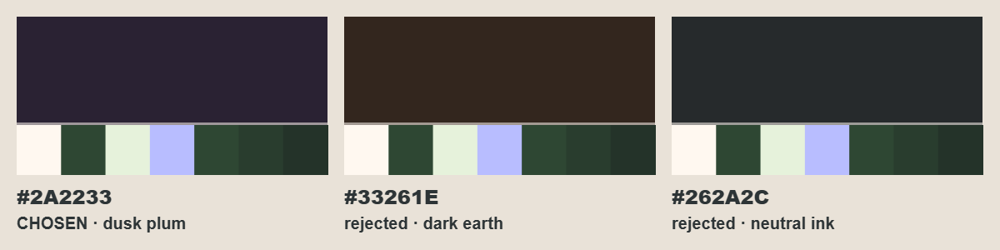

# Hub chrome v2 + ikone valuta — handoff

Brief: `docs/04-experience/design-drafts/hub-chrome-v2-cd-brief.md` (prva runda: `hub-header-footer-cd-brief.md`, paket `design_handoff_hub_chrome/`).
Jedan dizajn. Sve mjere u px baze 1080 × 1920, prenos 1:1.

## Šta otvoriti

| Fajl | Šta je |
|---|---|
| `design/HubChromeScreen.dc.html` | Ekran 1080 × 1920. Prop `page` = shop · journal · home_carousel · home_field · camp · arena; `state` = normal · locked · badge · safe_area; provjere: `grayscale`, `swipeAt` (0–4), `pressed` |
| `design/Hub Chrome Specs.dc.html` | Boja chromea (izabrana + 2 odbijene), svih 6 stranica + locked / badge / safe area / grayscale / swipe, anatomija headera (1,250 · 999,999 · 1.2M), stanja taba, vertikalni budžet, prije/poslije, Δ po stranici, animacije |
| `design/Icons.dc.html` | 8 ikona × 32 / 44 / 56 / 96 × svih 12 podloga iz §5.4, tab ikone u boji i krem liniji, Home vs Camp na 64, coin u runu |
| `assets/icons/` | 13 SVG spremnih za `game/assets/ui/chrome/` (+ opcioni zupčanik) |
| `godot/` | `hub_chrome_v2_export.json`, `ui_chrome.gd` (diff), `hub_tree.txt`, `README.md` (red prenosa) |

## Odlučeno

1. **Chrome #2A2233 (dusk plum)** za obje trake — jedini kandidat nasuprot zelenoj na krugu boja, pa uokviruje tamne livade umjesto da izgleda kao njihova tamnija nijansa (ΔE 22–32 prema Camp/Arena/karuselu, v1 7–18).
2. **Rub 3 px warm white @ 55 % ostaje** — prema tamnim stranicama drži 3,6–4,7:1; prema svijetlim sama traka drži 8,6–14,5:1.
3. **Footer 144 px** (rub 3 + sadržaj 141) — sredina ciljnog raspona 132–150; ispod 141 tile i indikator ne stanu uz hit-zonu ≥ 120 bez da se dodiruju.
4. **Δ = 36 px** ide stranicama; stranica je 1080 × 1633 od y 143, footer počinje na y 1776.
5. **Hit-zona taba = cijeli slot 216 × 141**; tile 184 × 108 je samo vidljiva ploča.
6. **Aktivan tab ima 4 signala** — peach ploča, ikona u boji (neaktivne su krem linija), 72 umjesto 64 px, peach indikator; u grayscale-u ploča L 0,57 prema traci 0,02.
7. **Indikator 72 × 8** (bio 196) — kratak znak iznad ikone čita se kao „ovdje si" i ne sudara se s badgeom na uglu tile-a.
8. **Tab ikone imaju dvije varijante** — boja za peach ploču, krem linija za traku; boja na tamnoj traci ×5 bi bila glasna i aktivni tab ne bi iskakao.
9. **Chipovi su udubljen neutralan well #1F1926**, ne više zlatni/mint/lavanda — boju valute sada nosi ikona, pa zlatno-na-zlatnom ne može nastati, a samo Settings (izdignut, svjetliji) izgleda kao dugme.
10. **Broj u chipu je krem #FFF8F0 48/800** — 16,3:1 na wellu.
11. **Ikona u chipu 64** (bila 56), gap 10, padding 14/18 — broju ostaje 190 px, isto kao v1, pa `999,999` staje.
12. **Home = kuća sa zabatom, Camp = vezana vreća iz koje vire klica i cvijet** — razlika je u siluetu (šiljat zabat i ravne linije vs. okrugla vreća) prije bilo kojeg detalja, pa radi na 64 i u krem liniji.
13. **Shop = tezga sa prugastom tendom i novčićem**, a ne kesa — kesa bi se miješala s Campovom vrećom.
14. **Arena = sto s dva kruga koji se dodiruju i iskrom** — krugovi su isti jezik kao seed chipovi u Areni, iskra je trenutak mergea.
15. **Journal = zatvorena knjiga s trakom** — album otkrića, bez cvijeta na koricama da ne konkuriše flower ikoni.
16. **Coin = zlatni disk s vidljivom debljinom, udubljenim licem, reljefnim listom i sjajem** — isti slojevi kao `coin_visual.gd` (#FFD56B / rub #D6A82F / lice #FFE8B8 / sjaj #FFF3D0), plus tamni obris 7/128 koji rješava zlatnu pilulu cijene (10,6:1) i zlatne podloge (9,1:1).
17. **Seed = sjeme koje je upravo puklo i pustilo dva lista** — čita se kao „tek kreće"; nema latica, pa ne liči na cvijet.
18. **Flower = pet okruglih latica, žuto srce, dva lista** — najgeneričniji cvijet (emoji-arhetip), bez oblika koji pripada ijednoj sezonskoj vrsti.
19. **Jedan stil za svih 8:** obris #2D3436 7 px na 128 (≈ 1,75 px na 32, 5,25 na 96), round join, 2–4 ravne pastel boje, najviše jedan krem sjaj, bez gradijenata.
20. **Nijedna ikona se ne tinta RGB-om** — sve su fiksne boje; kod smije mijenjati samo `modulate.a` (neaktivan tab 0,82, locked 0,6).
21. **NavLockPill tekst 38 px** (bio 26) — brief minimum; pilula ostaje 64 visoka i viri 36 iznad trake.
22. **Badge ostaje 44 / 26** — cifra unutar fiksnog diska, isti izuzetak kao v1; pomjeren na (+6, −8) jer je tile uži.
23. **Imena tabova ostaju kao accessible name** (`tooltip_text`) — nevidljiva, ali screen reader i dalje kaže „Camp".
24. **Settings zupčanik je precrtan** u istom jeziku (opciono) — inače bi header imao jednu ikonu iz starog seta.
25. **Home biranje sezone: raste samo kartica** (1100 → 1136); DOCK i PLAY_ROW zadržavaju mjeru i spuštaju se 36, pa se nijedan razmak ne mijenja i nema nove rupe između bloka i docka.
26. **Shop mockup je na #2E4733**, kako je danas u `ui_shop.gd` (brief navodi #B8E0F5) — chrome je provjeren na obje.

## Boja chromea

| | Hex | Zašto |
|---|---|---|
| **Izabrana** | `#2A2233` dusk plum | Nasuprot zelenoj; iz porodice lavande #D4A5FF; peach, zlato, mint i pink na njoj iskaču. Kontrast svijetle stranice 8,6–14,5:1 · ΔE Camp 32 / Arena 27 / karusel 22 |
| Odbijena | `#33261E` tamna zemlja | Topla i cozy, ali smeđa i tamnozelena se pri slabom svjetlu stapaju u maslinasto — ΔE prema karuselu samo 14 |
| Odbijena | `#262A2C` neutralna tinta | Razdvaja jer „nije boja", što se čita kao sistemski UI; siva uz zelenu izgleda prljavo — ΔE prema karuselu 10 |

Zamjena = jedna linija: `UiChrome.CHROME_DEEP` (+ `CHIP_WELL` kao ista boja ~25 % tamnije).

## Ikone

| Fajl | Tip | Varijante | Gdje |
|---|---|---|---|
| `icon_coin.svg` | u boji, fiksna | 1 — radi na svim podlogama | header chip 64 · run HUD 48 · **run pickup 96** · Camp cijena 32 · let u header 44 · season link 48 · Home disk 84 / red 44 · Shop cijena 48 · starter pack 48 |
| `icon_seed.svg` | u boji, fiksna | 1 | header chip 64 · run HUD 48 · Camp Seeds tab 44 · prazno stanje 56 · Trade bar prazan slot · **Home korpa** (zamjenjuje `icon_seed_light`) · Shop Loot Burst 48 |
| `icon_flower.svg` | u boji, fiksna | 1 (novo) | header FlowerChip 64 · Camp Flowers tab 44 · prazno stanje 56 (zamjenjuje `arena/icon_crystal.svg` na mjestima „cvijeće") |
| `tab_shop.svg` · `tab_shop_light.svg` | boja (aktivan) · krem linija (neaktivan) | 2 | footer 72 / 64 |
| `tab_journal.svg` · `_light` | isto | 2 | footer |
| `tab_home.svg` · `_light` | isto | 2 | footer |
| `tab_camp.svg` · `_light` | isto | 2 | footer |
| `tab_arena.svg` · `_light` | isto | 2 | footer |
| `icon_settings_light.svg` (+ `icon_settings.svg`) | jednobojna, fiksna | 2 | header 56 (opciono) |

SVG pravila: viewBox `0 0 128 128`, samo `path/circle/ellipse/rect`, ravni fillovi, 0 gradijenata, bez filter / mask / clipPath / text / image. Jedini `fill-rule="evenodd"` je rupa zupčanika.

## Δ po stranici (Δ = 36, stranica 1597 → 1633)

| Stranica | Konstante | Gdje ide Δ |
|---|---|---|
| Camp | `ui_camp.gd` `PAGE_H 1633` · `CONTENT_H 1585` · `SECTION_H 1289` · `SECTION_H_NO_SEASON 1585` | stash sekcija viša za 36; kartica 489 × 176 ista |
| Shop | `ui_shop.gd` `PAGE_H 1633` | duži prozor ShopScroll-a |
| Journal | `ui_journal.gd` `PAGE_H 1633` | duži skrol prozor, red ostaje 200 |
| Arena | `ui_arena.gd` polje `1633 − 44 = 1589` · `arena_meadow_bg.gd REF_H` | polje raste na donjem rubu; spawn grid (korak 150) ne dobija red — 36 ide u donju marginu |
| Home — polje sezone | `ui_home_field.gd PAGE (1080, 1633)`, `PAGE_Y 143` | livada je flex, upija sama |
| **Home — biranje sezone** | `ui_stage.gd STAGE (1080, 1633)` · `CARD (24, 24, 1032, 1136)` · `DOCK (0, 1184, 1080, 222)` · `PLAY_ROW (24, 1430, 1032, 180)` | **kartica sezone +36** (u art/ring zonu između naslova i tile-ova); dock i Play red iste mjere, pomjereni 36 dolje, `BOTTOM_GAP 23` ostaje |
| Ostalo | `home_stage_hint.gd`, svaki hardkodiran `1597` ili `1740` | pročitati `UiChrome.PAGE_H` / footer top 1776 |

## Šta se briše

- labela taba: `HubTab._label`, `UiChrome.TAB_ICON_GAP`, `TAB_LABEL_FONT_SIZE`, `tab_ink()`
- fill po valuti u `chip_style(fill)` (gold / mint / lavanda chip)
- `DiamondChip` iz headera (preimenovan u `FlowerChip`); `icon_diamond.svg` ostaje samo za run HUD
- proceduralni novčić u `coin_visual.gd _draw()` + `UiRun.COIN_FILL/EDGE/INNER/GLINT`
- `icon_seed_light.svg`; sve v1 `tab_*.svg` / `tab_*_light.svg` (prepisuju se)
- nakon provjere: `assets/pickups/coin.png`, `seed.png`

## Ideje van zadatka

- Dijamant, kad dobije potrošnju, može ući u Shop kao četvrti red valute umjesto nazad u header.
- Ista linijska krem varijanta ikona bi mogla zamijeniti Kenney ikone (retry, revive, double) u runu — cijela igra u jednom setu.
- Arena ★3 kristalni cvijet mogao bi biti `icon_flower.svg` s lavanda laticama — ista silueta, druga boja, bez novog crteža.
- Count-up broja u chipu (0,25 s) još nije implementiran ni iz v1 — sada, kad je broj krem na tamnom, pop se bolje vidi.
