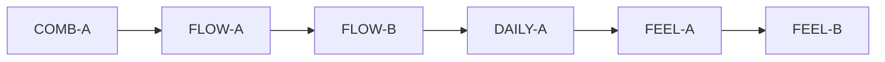

# IDEJE — ARENA-01 grupe pitanja

> [[ideje-arena|hub]] · freeze [[ideje-arena-pitanja|pitanja]] A0–A35 (2026-08-20).  
> **Kod šablon:** [[../06-production/plan-prompts-arena|plan-prompts-arena]] — **ne** 35 promptova.  
> Nije D0 blocker. Kanon [[../02-design/merge-arena-v1.1|merge-arena-v1.1]] se ne prepisuje dok ne kažeš „dodaj u scope“.

## Kako koristiti

1. Ova stranica = **mapa** freeze → implementacijski slice. Plan-agent čita grupu, ne svih 35 pitanja od nule.
2. Copy-paste **jedan** prompt iz `plan-prompts-arena.md` → novi chat → mode **Plan** → odobri plan → Agent kodira.
3. Redoslijed: **COMB-A → FLOW-A → FLOW-B → DAILY-A → FEEL-A → FEEL-B**.
4. G5 se **ne** kodira; svaki prompt ponavlja „Ne dirati“.

## Mapa grupa

| Grupa | Pitanja u kodu | Prompti | Ovisi o |
|-------|----------------|---------|---------|
| **G1 Combo** | A1 A2 A3 A12 A16 A20 A22 A26 A31 A33 | **COMB-A** | — |
| **G2 Field** | A10 A11 A11b A11c A14 A15 A25 | **FLOW-A**, **FLOW-B** | COMB-A (ne dirati combo math u FLOW-B) |
| **G3 Daily** | A6 A7 A8 | **DAILY-A** | COMB-A (combo 5 može biti daily target) |
| **G4 Feel** | A9 A18 A19 | **FEEL-A**, **FEEL-B** | COMB-A (reakcija na combo/T3); FLOW korisno za clear-field |
| **G5 Constraints** | A0 A4 A5 A13 A17 A21 A23 A24 A27–A30 A32–A35 | **nema** | — |

A24 (Done uvijek OK) je constraint na FLOW-B, ne poseban feature.

---

## G1 — Combo

**Slice docs:** [[ideje-arena-ciljevi|ciljevi]] · [[ideje-arena-feel|pair pulse]] · [[ideje-arena-pest|pest ne lomi]].

### Freeze (jednom)

| # | Odluka |
|---|---------|
| A1 C | Vizual + 1–2 coins na combo **5+**, **dnevni cap**. Nije put do upgradea. |
| A2 A | Prozor **~1.2–1.6 s**. |
| A3 A | Lomi **samo timeout**. Pest jede sjeme, ne resetira streak. Prazan drag ne kažnjava. Done/Back gase combo. |
| A12 A | Pair pulse dok držiš chip (isti `type_id`+`tier`). |
| A16 A | Nema extra Muncher freeze iz comba. Pest FSM se ne širi. |
| A20 A | Nema sesijskog scorea ni best-combo savea. Samo HUD broj. |
| A22 A | Nema auto-chain T1→T3. Svaki merge ručni. |
| A26 C | Nema tutorial rečenice / toast flaga. |
| A31 A | Copy: **`Combo`**. |
| A33 B | Pulse **u istom** COMB-A PR-u. |

### Što kod radi

1. Uspješan snap merge → ako je unutar prozora od prethodnog, `combo += 1`, inače `combo = 1`.
2. HUD: sakrij na 1, pokaži od **2** (čitljivije). Label `Combo` + broj.
3. Na **combo >= 5** grant **1–2 coins** (jednom po tom pragu u nizu, ne svaki tick 5→6→7 osim ako plan eksplicitno kaže „svaki merge dok je ≥5“ — **preporuka:** grant samo kad combo **dostigne** 5, zatim cap dnevni npr. 10 coins; imenovana konstanta u `GameState`).
4. Timeout → combo 0, HUD nestaje.
5. Drag start → svi validni partneri trepere. Drag end → ugasi pulse.
6. Pest eat **ne** zove combo reset.

### Fajlovi

- [`merge_arena_controller.gd`](../../game/scripts/camp/merge_arena_controller.gd) — `_on_chip_released`, HUD node, timer
- [`arena_seed_chip.gd`](../../game/scripts/camp/arena_seed_chip.gd) — pulse flag / draw
- [`game_state.gd`](../../game/scripts/autoload/game_state.gd) — wallet + dnevni combo-coin cap (novi save key, migrate default 0)
- [`merge_arena_smoke.gd`](../../game/scripts/dev/merge_arena_smoke.gd) + novi `arena_combo_smoke.gd` ako treba izolacija

### Acceptance

HUD pokazuje `Combo 2+` unutar ~1.5 s između mergeva; timeout gasi; peti merge u nizu daje coins unutar cap-a; dok držiš Clover T1, drugi Clover T1 treperi; pest eat ne gasi broj.

### Nije u G1

Bloom panel, auto-refill, leftover T2, daily, Pip, tint, Sort, tajmer, auto-chain, combo SFX (A27).

### Prompt

**COMB-A** — jedan Plan prompt (HUD + math + coins + pulse). Dva PR-a bi kršila A33.

---

## G2 — Polje / T2 / pour

**Slice docs:** [[ideje-arena-bloom|bloom]] · [[ideje-arena-feel|clutter]].

### Freeze (jednom)

| # | Odluka |
|---|---------|
| A10 A | T2 ostaje na polju za T2→T3. |
| A11 D | Auto-riješi T2 kad **nema šanse za par u ovom runu**. |
| A11b E | Taj T2 → **2× T1** istog tipa u bag. Nije coin, nije crystal. |
| A11c B | U areni **nema** Donate/Album/Basket panela. T3 → garden stash. Spend samo Camp. |
| A14 D | Cap **40**. Auto-pour kad chipova na polju **≤10**, dok bag ima sjeme. |
| A15 B | Pour (ručni i auto) preferira tipove koji već imaju orphan/par na polju. |
| A25 A | Odd **T1** ostaju do **Done** (bag). Ne auto-return T1. Ne 3 T1→coin. |

**Šansa za T2 par:** na polju postoji drugi T2 istog tipa, **ili** preostali T1 tog tipa (polje + bag) mogu proizvesti još jedan T2 (≥2 T1). Ako bag još može pourati taj tip, **ne** recycle-aj T2.

### FLOW-A (prvi)

Ukloni `BloomActionPanel` / tap-spend. T2+T2 i dalje T3 crystal. Kad leftover T2 nema para u runu → ukloni chip, `seed_bag[type] += 2`. Ne dirati combo.

**Acceptance:** tap T2 ne otvara panel; odd T2 nestane u 2 T1 u bagu; T3 i dalje stash.

### FLOW-B (drugi)

Kad `_chips.size() <= 10` i bag > 0 i slots > 0 → pour do 40 (ili prazan bag). Prefer orphan. Ne forsiraj ostati do praznog baga (A24). Ne dirati combo math.

**Acceptance:** merge dok ostane 10 chipova → vreća se sama istrese; novi chipovi guraju tipove kojih već ima 1 na polju ako bag to ima.

### Fajlovi

- `merge_arena_controller.gd` — panel setup/hide, leftover resolve, `_on_bag_clicked` / auto pour
- `GameState` — bag add 2 T1, pour pick order
- `arena_odd_t2_smoke.gd` — ažurirati (više nije recycle T2 kao 1 seed ako je to stari ugovor; sada 2 T1)
- `arena_seed_bag.gd` — vizual wiggle; auto-pour ne mora čekati tap

### Nije u G2

Combo HUD, daily, Pip, Sort, Camp donate pravila (samo da arena više ne zove panel).

---

## G3 — Daily

**Slice docs:** [[ideje-arena-ciljevi|daily]].

### Freeze (jednom)

| # | Odluka |
|---|---------|
| A6 A | **Jedan** arena zadatak / local day (DG-01 slice, ne trijada). |
| A7 C | Nagrada **samo badge / streak**. Bez coina, bez sjemena. |
| A8 C | Progress u areni (`2/5`); claim/badge u **Campu** (postojeći daily chest duh). |

Generator (jedan od, skalirano na unlock): Merge 3× T2 / 1× T3 / Combo 5. Ne IAP, ne ad, ne mythic-only.

Claim 1×/dan, **novi** day key (ne gutati `last_daily_chest_day`).

### FLOW ovisnost

Daily „Merge 3× T2“ i dalje ima smisla nakon FLOW-A (T2 postoji na polju). Combo 5 zahtijeva COMB-A.

### Prompt

**DAILY-A**.

**Acceptance:** u areni vidiš npr. `2/5`; u Campu badge kad je gotovo; bez wallet+; sutra novi zadatak.

### Nije u G3

Cliff rečenica u areni (A5 C). Puna DG-01. Combo coins (to je G1).

---

## G4 — Feel

**Slice docs:** [[ideje-arena-feel|feel]].

### Freeze (jednom)

| # | Odluka |
|---|---------|
| A9 B | Clear-field: **samo VFX**, bez coina. Nije fail. |
| A18 B | Mali Pip na rubu; reakcija na combo/T3; nije kolizija, nije eat target. |
| A19 B | Sesijski livada **tint** s brojem T3 u sesiji; reset na Done. |
| A27 | **Nije** ovaj grupa — pitch-up na globalni SFX pass. |

### FEEL-A

Pip + tint. Ne dirati combo math, pour, daily.

**Acceptance:** Pip vidljiv na rubu playfielda; T3 / visoki combo = kratka reakcija; BG tint raste s T3 u sesiji i nestaje na Done.

### FEEL-B

Clear-field VFX kad nema legalnog para (odd leftover OK). Sesijski, ne coin.

**Acceptance:** kad ostane samo nespareno sjeme, jedan celebration; možeš i dalje pour/Done.

### Nije u G4

Sort, juice particles za svaki merge (osim što pulse već postoji iz COMB-A), audio.

---

## G5 — Nema koda (constraints)

Citiraj u **Ne dirati** svakog COMB/FLOW/DAILY/FEEL prompta.

| # | Odluka | Zašto nema prompta |
|---|--------|-------------------|
| A0a F / A0b B | Smjer | Već freeze |
| A4 A / A5 C | Merge cliff **samo Camp** | Arena HUD slice ispada; `garden_cliff_text` ostaje |
| A13 C | Nema Sort | Magnet + pulse |
| A17 A | Pest nije igračka | Nema feed / cozy toggle |
| A21 A | Nema tajmera | Sandbox + combo prozor |
| A23 A | Merge Hint ostaje tekst | Izbacivanje kasnije, ne ovaj track |
| A24 C | Prvi pour OK, Done uvijek | Constraint na FLOW-B, ne feature |
| A27 A kasnije | Pitch-up ding | D0-P / globalni SFX |
| A28 A | Ništa novo ads/IAP u areni | Pillar 2 |
| A29 B | Interstitial parking | Nije ARENA-01 kod |
| A30 C | Mythic ne dirati | Nema outline / combo izuzetka |
| A32 A | Combo prvo, daily zadnje | Redoslijed promptova |
| A33 B | Pulse u COMB-A | Već G1 |
| A34 A | Prompti pa kod | Ovaj paket |
| A35 A | Lista dovoljna | — |

**Zajedničko Ne dirati (svi prompti):** Home dual-band, sezone, Shop Select, AdMob, SAVE_VERSION bump osim novih arena daily/combo-cap keyeva uz migrate, unique seed ID-evi, pest **FSM** (brzina/eat/T3 freeze 2 s ostaju), pay-to-merge, energy, fail u areni, vraćanje bloom panela, prepis `merge-arena-v1.1.md` / `ekonomija-brojevi.md` dok „dodaj u scope“.

Headless: `--rendering-driver opengl3`. GUI Godot jednom na kraju sesije: `.\scripts\godot-run.ps1` (`block_until_ms` 0). Ne `godot-watch`.

---

## Agent

- Novi kod samo nakon Plan prompta iz [[../06-production/plan-prompts-arena|plan-prompts-arena]].
- Ne spajati COMB-A i FLOW-A u jedan chat.
- FLOW-A prije FLOW-B. DAILY nakon COMB. FEEL zadnje.

## Povezano

- [[ideje-arena|hub]] · [[ideje-arena-pitanja|pitanja]]
- [[../06-production/plan-prompts-arena|prompti]]
- [[../06-production/CHECKPOINT|CHECKPOINT]]
