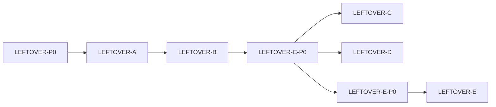

# IDEJE — ARENA-02 grupe pitanja

> [[ideje-arena-leftover|hub]] · freeze [[ideje-arena-leftover-pitanja|pitanja]] L0–L37 (2026-08-28).  
> **Kod šablon:** [[../06-production/plan-prompts-arena-leftover|plan-prompts-arena-leftover]] — **ne** 37 prompt.  
> Nije D0 blocker. Kanon spec se ne prepisuje dok „dodaj u scope“.  
> **Leftover G5** = field T1 (E-P0 docs). **E kod ne** — [[ideje-arena-sort|ARENA-03]] SORT-B. **Nije** ARENA-01 G5 (Sort/ads constraints).

## Kako koristiti

1. Plan-agent čita **ovu** mapu + hub, ne cijeli ARENA-01 iznova.
2. Copy-paste **jedan** prompt → novi chat → **Plan** → odobri → Agent.
3. Redoslijed: **LEFTOVER-P0 → A → B → C-P0 → C → D → E-P0**. **Ne LEFTOVER-E** — [[../06-production/plan-prompts-arena-sort|SORT-B]].
4. G3 se **ne** kodira kao feature; svaki prompt ponavlja „Ne dirati“.
5. **Ne spajati C i D.** Overlay hide nije grant.
6. **Ne spajati D i E.** Debug 100 nije field T1 return. Overlay prompti (B/C) se ne dira.

## Mapa grupa

| Grupa | Pitanja u kodu | Prompti | Ovisi o |
|-------|----------------|---------|---------|
| **Docs** | L19 L20 | **LEFTOVER-P0** | — |
| **G1 Pour** | L0b L0c L2 L3 L7 L11 L14 | **LEFTOVER-A** | P0 |
| **G2 Overlay** | L0d L4 L5 L6 L8 L9 L15 L16 L17 | **LEFTOVER-B** | A (pull 0 mora biti definiran) |
| **Docs C/D** | L21–L30 | **LEFTOVER-C-P0** | B |
| **G2 nastavak** | L21 L22 L23 L24 L25 | **LEFTOVER-C** | C-P0 |
| **G4 Grant** | L26 L27 L28 L29 L30 | **LEFTOVER-D** | C-P0 (docs); C nije hard ovisnost |
| **G5 Field** | L1 L31 L32 L33 L34 L35 L36 L37 | **LEFTOVER-E-P0** (docs). **Ne E kod** — ARENA-03 SORT-B | C-P0 (docs); **ne** čeka D kod |
| **G3 Constraints** | L10 L12 L13 L18 | **nema** (citiraj u A/B/C/D/E) | — |

C i D oba čitaju C-P0. D **ne** čeka C kod. E-P0 / E **ne** čekaju D kod (field resolve radi i s 50 T1), ali playtest Muncher leftover-a je lakši nakon D. **Ne spajati D i E.** Overlay C ostaje. U praksi za Muncher: D pa E.

## G1 — Pour

**Slice docs:** [[ideje-arena-leftover-math|math]] · [[ideje-arena-leftover-pour|pour]].

| # | Odluka u kodu |
|---|----------------|
| L0b | `pull_seeds_to_arena` / queue: po tipu samo `k*4` T1. |
| L0c | `ARENA_AUTO_REFILL_AT = 12`. Polje 0 ne auto. Cap 40. |
| L2 | A15 orphan ne trese 3. |
| L3 | Mythic isto. |
| L7 | Ne dirati `SEED_BAG_SOFT_CAP`. |
| L11 | FLOW-A T2 recycle ostaje. |
| L14 | Remainder tap nije „Nothing to pour.“ — to je B. A smije vratiti `[]`. |

**LEFTOVER-A** ✅

Pour math + refill 12. Ne overlay.

**Acceptance:** 6 clover → 4 pulled, 2 bag; 3 daisy → 0 pulled; auto na 12; Done slobodan.

## G2 — Overlay + dismiss

**Slice docs:** [[ideje-arena-leftover-popup|popup]].

| # | Odluka u kodu |
|---|----------------|
| L0d | Bag tap kad pulled==0 i bag>0 i ima slota → overlay. |
| L4 | Tap overlay = Done path u Camp. |
| L5 L8 | Lista `n/4`, redovi nisu trade. |
| L6 L9 | EN naslov, bez tutorial toast. |
| L15 | Auto-refill ne otvara overlay. |
| L21 | Hide overlay + clear lista **prije** `go_to_camp_hub` (Done, Back, overlay tap). |
| L22 | `set_arena_page_active(false)` hide. |
| L23 | Povratak: čist playfield, overlay false, bag remainder ostaje. |
| L24 | Naslov svijetao u panelu; ne `UI_TEXT` sivi. |
| L25 | Ne dirati pour / kada se overlay **otvara**. |

**LEFTOVER-B** ✅ — otvaranje overlaya, `n/4`, tap→Camp (bez hide).

**LEFTOVER-C** ✅ — hide + restore + kontrast naslova. Smoke `arena_leftover_c_smoke`.

**Acceptance C:** overlay tap/Done → `visible == false`; `set_arena_page_active(true)` overlay false, 0 chipova; naslov `You need more seeds!` čitljiv; pour A netaknut.

## G4 — Debug 100 T1

**Slice docs:** [[ideje-arena-leftover-grant|grant]].

| # | Odluka u kodu |
|---|----------------|
| L26 | Overwrite jednom po debug procesu, ne na Arena tab return. |
| L27 | 5 tipova, unlock 4, tutorial complete; soft cap 40 ostaje; produkcija no-op. |
| L28 | clover 19, daisy 22, buttercup 13, tulip 28, sunflower 18. |
| L29 | Ugasiti Arena `ensure_dev_unlocked_seeds(10)` top-up. |
| L30 | `grant_test_seeds.gd` ista mapa. |

**LEFTOVER-D** ✅ — `apply_debug_leftover_test_bag`; smoke `arena_leftover_d_smoke`.

**Acceptance D:** svaki novi debug process bag = freeze 100; drugi apply u istom procesu ne resetira potrošeno; `DEBUG_DEV_RESOURCES` false ne dira bag.

## G5 — Field leftover T1 (L1 reopen)

**Slice docs:** [[ideje-arena-leftover-field|field]].

L1 više **nije** G3 blokada. Mid-session neparni T1 tog tipa ide u torbu (`count % 2 == 1` → **jedan** T1). 3 clover → 1 bag + 2 polje. Nije `n%4`. Nije pour remainder da se popravi ×4 (L2 ostaje G1). Overlay B+C **ne dirati**.

| # | Odluka u kodu |
|---|----------------|
| L31 | Po tipu, T1 only: neparan count → `add_seeds_to_bag(type, 1)` + skini idle T1. |
| L32 | Hookovi: `_pest_eat_chip` i nakon mergea. `_resolve_stranded_t1` **prije** `_resolve_stranded_t2`. |
| L33 | Ne dragging; skip ako nijedan idle. |
| L34 | Bag `remaining_capacity < 1` → ostavi na polju. Soft cap 40. |
| L35 | Overlay / pour A / refill 12 / pest tajmeri — ne dirati. |
| L36 | FEEL-B ostaje. |
| L37 | Mythic isto `n%2`. Nema SAVE_VERSION. |

**LEFTOVER-E-P0** ✅ (docs, ovaj slice).

**LEFTOVER-E** **ne raditi.** Zamjena: [[ideje-arena-sort-vacuum|ARENA-03 vacuum]] — 3 T1 → sva 3 u torbu + lock (ne ostavlja par).

**Acceptance E (povijesno, ne kodirati):** 4 clover, eat 1 → 2 na polju, bag +1; 1 daisy sam → 0 polje, bag +1; 2 clover netaknuti. ARENA-03 SORT-B: 3 T1 → 0 polje, bag +3.

## G3 — Nije kod (constraints)

L1 **nije** ovdje (G5 / E). L10 FEEL-B ostaje. L12 combo/daily/Pip ne. L13 nema SAVE_VERSION. L18 nema coin za odd T1.

Citiraj u C, D i E promptima:

Ne dirati: combo coins/HUD, daily keys, Pip/tint, pest FSM (brzina, eat, T3 freeze), Home, Shop, AdMob, bloom, Sort, kanon `merge-arena-v1.1.md`, pour floor-4, `ARENA_AUTO_REFILL_AT`. E dodatno: NeedMoreSeedsOverlay, `ensure_dev` (to je D). D dodatno: overlay hide.

## Nije u ARENA-02

T4, lasso, ads, energy, fail, pay-to-merge, Home dual-band, produkcijski 100-seed pack.

## Povezano

- [[ideje-arena-leftover|hub]] · [[../06-production/plan-prompts-arena-leftover|prompti]]  
- [[ideje-arena-leftover-field|field G5]] · [[ideje-arena-leftover-grant|grant G4]]  
- [[ideje-arena-sort|ARENA-03]] · [[../06-production/plan-prompts-arena-sort|sort prompti]]  
- [[ideje-arena-grupe|ARENA-01 grupe]] (ne miješati COMB/FLOW sliceove u isti PR; leftover G5 ≠ ARENA-01 G5)
