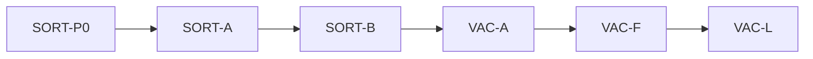

# IDEJE — ARENA-03 grupe pitanja

> [[ideje-arena-sort|hub]] · freeze [[ideje-arena-sort-pitanja|pitanja]] S0–S32 (2026-08-29).  
> **Kod šablon:** [[../06-production/plan-prompts-arena-sort|plan-prompts-arena-sort]] — **ne** 26 prompt.  
> Nije D0 blocker. Kanon spec se ne prepisuje dok „dodaj u scope“.  
> Overlay = ARENA-02 G2 (B+C), **nije** novi overlay prompt. Grant D **nije** ovaj track.

## Kako koristiti

1. Plan-agent čita **ovu** mapu + hub.
2. Copy-paste **jedan** prompt → novi chat → **Plan** → odobri → Agent.
3. Redoslijed: **SORT-P0 → A → B → VAC-A → VAC-F → VAC-L**.
4. G4 se **ne** kodira; svaki prompt ponavlja „Ne dirati“.
5. **Ne spajati A i B.** Pour nije vacuum.
6. **Ne LEFTOVER-E.** Ne dirati overlay C / grant D.

## Mapa grupa

| Grupa | Pitanja u kodu | Prompti | Ovisi o |
|-------|----------------|---------|---------|
| **Docs** | S23 S24 | **SORT-P0** | — |
| **G1 Pour** | S1 S2 S3 S4 S9 S14 S19 | **SORT-A** | P0 |
| **G2 Vacuum** | S5 S6 S10 S11 S12 S13 S15 S16 S26–S32 | **SORT-B**, **VAC-A**, **VAC-F**, **VAC-L** | A (queue/skip locked mora postojati) |
| **G3 Overlay reuse** | S7 S20 | **nema** (B+C već) | — |
| **G4 Constraints** | S8 S17 S18 S21 S22 S25 | **nema** (citiraj u A/B) | — |

A ne čeka leftover-E. B ne čeka D. Overlay već radi na „nema pourable ≥4“.

## G1 — Pour

**Slice docs:** [[ideje-arena-sort-math|math]] · [[ideje-arena-sort-pour|pour]].

| # | Odluka u kodu |
|---|----------------|
| S1 | `pull_seeds_to_arena` / queue: sav count, ne floor-4. |
| S2 | Red `CHAIN`, cijeli tip. Ukloniti „prva 2 rarity“. |
| S3 | Cap 40, `ARENA_AUTO_REFILL_AT` 12, polje 0 ne auto. |
| S4 | Skip `bag[type] < 4`. |
| S9 | Nema A15 pour-3. |
| S14 | Auto pull 0 ne otvara overlay. |
| S19 | Mythic isto. |

**SORT-A** ✅ — `arena_leftover_a_smoke` (31+9, skip &lt;4, lock stub, refill 12, polje 0 ne auto).

**Acceptance A:** 31 daisy + 30 buttercup → 31+9 na prvi pour 40; clover 3 ostaje u bagu; leftover_a floor-4 asserti prepisani.

## G2 — Vacuum + lock

**Slice docs:** [[ideje-arena-sort-vacuum|vacuum]].

| # | Odluka u kodu |
|---|----------------|
| S5 | t1_eq &lt; 4 → svi idle chipovi tipa u bag kao T1. Asap. |
| S6 | Lock do Done. |
| S10 | T2 → 2 T1. |
| S11 | 5 T1 ne vacuum. |
| S12 | Eat + merge + drop + pour. |
| S13 | Ne dragging. |
| S15 | VAC-A unbounded add. |
| S16 | FEEL-B ostaje. |
| S26–S30 | VAC-F ghost let + bag punch. |
| S31–S32 | VAC-L lock samo bag &lt; 4; pour na praznom polju nakon vacuuma. |

**SORT-B** ✅ — `arena_sort_b_smoke` (3 T1 → bag +3 lock; 5 ostaju; eat 4→vacuum 3; locked daisy **3** ne poura).

**VAC-A** ✅ — `arena_vacuum_stuck_smoke` (over-cap; 3+3 remainder; S11; pour vacuumira leftover).

**VAC-F** ✅ — `arena_vacuum_fly_smoke` (3 T1 → 0 chipova, bag 3, fly helper).

**VAC-L** ✅ — `arena_vacuum_l_smoke` (nakupljeni leftover ≥4 opet pour; S32).

**Acceptance B:** 3 T1 → bag +3, 0 polje, lock; 5 T1 ostaju; locked daisy **3** ne poura, buttercup da; overlay b/c prolazi.

## G3 — Overlay (nema koda)

S7 S20: postojeći NeedMoreSeedsOverlay. SORT ne mijenja hide, naslov, `n/4`. Stuck = nema unlocked tipa ≥4.

## G4 — Nije kod

S8 nema leftover-E. S17 combo/daily/Pip. S18 nema SAVE_VERSION. S21 C/D. S22 nema coin. S25 pest FSM.

Citiraj u A i B:

Ne dirati: NeedMoreSeedsOverlay, `_hide_need_more_overlay`, `apply_debug_leftover_test_bag`, combo HUD, daily, Pip, pest tajmeri/T3 freeze, Home, Shop, AdMob, kanon `merge-arena-v1.1.md`. A ne vacuum. B ne mijenja CHAIN queue osim čitanja lock seta.

## Nije u ARENA-03

Sort gumb, T4, ads, energy, fail, pay-to-merge, produkcijski seed pack, leftover-E.

## Povezano

- [[ideje-arena-sort|hub]] · [[../06-production/plan-prompts-arena-sort|prompti]]
- [[ideje-arena-leftover-grupe|ARENA-02 grupe]] (E superseded; overlay/grant ostaju)
