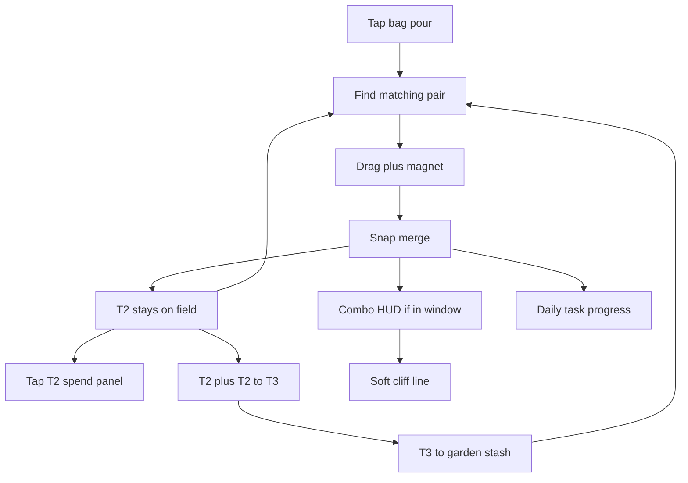

# IDEJE — Merge Arena zabavnija (ARENA-01 hub)

> **ID:** **ARENA-01** · v1.1+ (nije v1 launch blocker, nije D0-P).  
> **Kod:** još nije. Prompti: [[../06-production/plan-prompts-arena|plan-prompts-arena]] **COMB-A → FLOW-A → FLOW-B → DAILY-A → FEEL-A → FEEL-B**. Grupe: [[ideje-arena-grupe|grupe]].  
> **Freeze:** A0–A35 **2026-08-20** — [[ideje-arena-pitanja|pitanja]].  
> **Prethodnik:** [[../02-design/merge-arena-v1.1|MA-01]] magnet arena ✅ · [[../02-design/merge-arena-pest|MA-01b]] Muncher ✅ · [[../06-production/ideje-kad-predloziti|UX-04]] hub page Arena ✅.  
> **Pillar:** [[../01-vision/design-pillars|Fair F2P]] — merge ostaje besplatan; nema pay-to-merge. [[../01-vision/design-pillars|Pillar 3]] — nema fail statea u areni; ciljevi su nagrada, ne kazna.

## Pitch

Merge Arena **radi**. Magnet drag, pour iz vreće, T1→T2→T3, Muncher, bloom panel (Donate / Album / Basket) — sve je u kodu. Problem nije „nema mergea“. Problem je **monotonija**: isti verb zauvijek, bez kratkog cilja, bez comba, bez razloga da sljedeći merge bude uzbudljiviji od prethodnog.

ARENA-01 **ne zamjenjuje** MA-01. Ne uvodi novi input (lasso, flick, T4, runde s tajmerom). Dodaje sloj **cilj + feedback** na postojeći magnet:

1. **Combo** — kratki prozor, HUD `Combo`, coins na 5+ s dnevnim capom.
2. **Soft cliff** — merge poruka **samo u Campu** (nije arena HUD).
3. **Dnevni arena zadatak** — jedan DG-01 slice; progress u areni, badge u Campu, bez loota.

Bol je **mješavina** (clutter, ravan loop, slabi juice, T2 chore, pest). Katalog B/C (pulse, sort, T2 inbox, pest-igračka) ostaje dokumentiran; u prvi kod ulazi samo ono što freeze A12/A13/A33 odobri.

## Zašto sada

MA-01 je riješio slot overflow (gredice). Nije riješio **šta radiš drugi i treći minut** u areni. Camp ima `garden_cliff_text`; arena ima generički `info_label` („keep merging“). DG-01 je u specu, nije u kodu. Spec i dalje drži otvoreno: T2 inbox vs polje, Sort gumb.

D0 je launch prep (SFX, art, Settings). ARENA-01 je **v1.1+ scratch** kao HOME-04. Ne blokira Play internal. Ne miješa se u D0-P art pass osim ako kasnije eksplicitno spojiš juice slice.

## Freeze (chat 2026-08-20)

| # | Tema | Odluka |
|---|------|--------|
| **A0a** | Što je najmonotonije | **Mješavina** — bira se iz kataloga kroz A1–A35, ne jedna dijagnoza. |
| **A0b** | Koliko daleko u prvom tracku | **Isti magnet + lagani ciljevi** (combo, soft cliff, daily). Nije samo juice. Nije redesign verbova. |
| **A1** | Combo nagrada | **C** — vizual + 1–2 coins na combo 5+, dnevni cap. |
| **A2** | Combo prozor | **A** — kratko ~1.2–1.6 s. |
| **A3** | Što lomi combo | **A** — samo timeout. |
| **A4** | Soft cliff | **A** — primarna poruka = merge. |
| **A5** | Gdje stoji cliff | **C** — samo Camp; cliff slice ispada iz arene. |
| **A6** | Daily | **A** — jedan arena zadatak (DG-01 slice). |
| **A7** | Daily nagrada | **C** — badge / streak, bez loota. |
| **A8** | Daily UI | **C** — progress u areni, claim u Campu. |
| **A9** | Clear-field | **B** — samo VFX. |
| **A10** | T2 na polju | **A** — ostaje; T2→T3 je igra. |
| **A11** | Bloom spend | **D** — auto-riješi T2 kad para u runu više nema. |
| **A11b** | Auto-T2 kamo | **E** — 2× T1 u bag; ne Donate/Album/Basket. |
| **A11c** | Spend u areni | **B** — nema panela; T3 crystal; spend samo Camp. |
| **A12** | Pair pulse | **A** — isti track kao combo. |
| **A13** | Sort | **C** — ne; magnet + pulse. |
| **A14** | Pour količina | **D** — cap 40; auto-refill na 10. |
| **A15** | Pour sadržaj | **B** — preferiraj orphan tipove na polju. |
| **A16** | Muncher vs combo | **A** — jede sjeme; ne lomi combo; nema extra freeze. |
| **A17** | Pest igračka | **A** — ne sada. |
| **A18** | Pip u areni | **B** — rub, reakcija combo/T3. |
| **A19** | Playfield BG | **B** — sesijski livada tint po T3. |
| **A20** | Score | **A** — samo combo broj. |
| **A21** | Tajmer | **A** — bez tajmera. |
| **A22** | Auto-chain | **A** — ručno. |
| **A23** | Merge Hint | **A** — ostaje tekst; izbacivanje kasnije. |
| **A24** | Duljina sesije | **C** — prvi pour OK, ostatak opcionalan. |
| **A25** | Odd leftover | **A** — T1 na Done; T2 već 2×T1. |
| **A26** | Tutorial combo | **C** — otkriće samo. |
| **A27** | Audio | **A** pitch-up, ali tek globalni SFX pass. |
| **A28** | Monetizacija | **A** — ništa novo u areni. |
| **A29** | Interstitial | **B** — parking, ne ovaj kod. |
| **A30** | Mythic | **C** — ne dirati. |
| **A31** | HUD copy | **A** — `Combo`. |
| **A32** | Redoslijed koda | **A** — combo prvo, daily zadnje. |
| **A33** | Prvi PR | **B** — pulse uz combo. |
| **A34** | Kad kod | **A** — odmah nakon freezea. |
| **A35** | Ostalo | **A** — ništa više. |

Puna lista s obrazloženjem: [[ideje-arena-pitanja|pitanja]].  
**Kanon** ([[../02-design/merge-arena-v1.1|merge-arena-v1.1]], [[../02-design/ekonomija-brojevi|ekonomija-brojevi]]) se **ne** prepisuje dok ne kažeš „dodaj u scope“ (bloom panel u specu ostaje kanon dok se ne promovira ovaj freeze).

## Simptom vs cilj

| Danas | Cilj (freeze) |
|-------|----------------|
| Jedan verb: nadi par, dragni, ponovi | Isti verb + **Combo** HUD, prozor ~1.5 s, coins na 5+ (cap) |
| `info_label` generički | Bez cliff rečenice u areni; daily `2/5` mali chrome |
| Daily chest bez arena zadatka | 1 zadatak; progress areni, badge Camp, bez loota |
| T2 tap → Donate/Album/Basket | **Nema panela.** T2 merge u T3; leftover T2 → **2× T1** u bag |
| Muncher jede; T3 freeze 2 s | Ostaje; **ne** lomi combo; nema extra freeze |
| Do 40, random pour, ručni tap | Cap 40; **auto-refill na 10**; prefer orphan tipove |
| Nema scorea / runde | Samo Combo broj; **bez** tajmera |
| Merge Hint tekst | Ostaje; izbacivanje kasnije |

## Što ARENA-01 **jest**

- Scratch za zabavniju arenu **bez** novog merge verb-a.
- Freeze A0–A35 (2026-08-20).
- Kod (nakon promptova): **A combo+pulse** → leftover T2 / auto-refill (ako nije u A) → **C daily** badge. Cliff u areni **nema**.
- Pair pulse u prvom combo PR-u. Pip reakcija + livada tint = kasniji feel, ne blocker prvog PR-a.

## Što ARENA-01 **nije**

- Nije zamjena MA-01 magneta / bag pour / Done → Camp. **Jest** uklanjanje bloom panela iz arene (freeze A11c).
- Nije novi input: lasso, flick, multi-touch, T4, gravity well.
- Nije fail state, energy, pay-to-merge, combo shield IAP.
- Nije leaderboard / sesijski score / best-combo save.
- Nije interstitial u ovom tracku (A29 parking).
- Nije D0 launch blocker. Audio pitch-up čeka globalni SFX.
- Nije puna DG-01 trijada.
- Nije Home dual-band, sezone, unique seed ID-evi, AdMob, Play Console.
- Nije prepis kanona dok ne kažeš „dodaj u scope“.

## Katalog (prioritet)

### A — Ciljevi na magnetu (ovaj track)

Opširno: [[ideje-arena-ciljevi|ciljevi]].

| Ideja | Jedna rečenica |
|-------|----------------|
| **Combo** | Merge unutar prozora nakon prethodnog; HUD broj; prekid po A3; nagrada po A1. Nikad obavezno za upgrade. |
| **Soft cliff** | Jedna poruka: sljedeći sitni cilj. Sink s Camp cliffom, ne drugi quest log. |
| **Daily** | 1 zadatak / dan (prvi DG-01 slice). Ne blokira run. Claim 1×/local day. |
| **Clear-field** | Opcionalni celebration kad nema legalnih parova (A9). Nije fail. |

### B — Feel / jasnoća (podržava A)

Opširno: [[ideje-arena-feel|feel]].

| Ideja | Jedna rečenica |
|-------|----------------|
| **Pair pulse** | Dok držiš chip, isti tip+tier treperi (A12). |
| **Sort** | Gumb ili auto-grozdovi (A13). Spec već pita. |
| **Juice** | Merge pop, čestice, ding — D0-P overlap; ne u A kodu osim A27. |
| **Clutter** | Max chipovi, valovi poura, preferirani parovi (A14–A15). |

### C — Bloom / pest (samo ako freeze uvuče)

Opširno: [[ideje-arena-bloom|bloom]] · [[ideje-arena-pest|pest]].

| Ideja | Jedna rečenica |
|-------|----------------|
| **T2 inbox** | Spec preporuka; kod ostavlja T2 na polju (A10). |
| **Spend** | Panel 3 gumba vs default tap vs swipe (A11). |
| **Pest-igračka** | Nahrani / cozy sleep — default **ne sada** (A17). |
| **Combo freeze** | Visoki combo produžuje Muncher freeze (A1 D / A16 B). |

### Van tracka

Novi verbovi, T4, lasso, runde s tajmerom kao default, leaderboard, interstitial na Done, pay-to-merge, redesign arene u vrt-grid.

## Pojmovnik ARENA-01

| Pojam | Značenje |
|-------|----------|
| **Playfield** | Zona chipova u `merge_arena.tscn` (`$RootVBox/Playfield`). |
| **Pour** | Tap vreće → T1 (i leftover) skaču na polje, cap `ARENA_MAX_CHIPS` (40). |
| **Magnet** | Dok držiš chip, isti tip+tier u `ARENA_MAGNET_RADIUS` se privlači. |
| **Snap merge** | Release unutar `ARENA_SNAP_DISTANCE` + isti tip+tier → `try_merge_arena_chips`. |
| **Combo** | Broj uzastopnih mergeva unutar prozora (A2). HUD, nije ekonomija dok A1 ne kaže. |
| **Combo window** | Sekunde od zadnjeg uspješnog mergea do isteka. |
| **Soft cliff** | Jedna rečenica sljedećeg cilja. Nije quest log. |
| **Daily arena task** | Jedan zadatak vezan uz merge/combo/T3; day key kao daily chest. |
| **Clear-field** | Nema više legalnog para na polju (odd leftover OK). |
| **Bloom panel** | Donate / Album / Basket na tap T2+ (`BloomActionPanel`). |
| **Muncher** | Pest: jede T1/T2, freeze 2 s na T3 (`arena_pest.gd`). |
| **Done** | `commit_arena_chips_to_bag` + unlock hub nav + Camp. |

## Player loop (danas vs cilj)

Danas: `pour → hunt → drag → merge → hunt`.  
Cilj: isti lanac, ali svaki merge **povećava combo**, **pomjera cliff**, **broji daily**; Done i dalje nije fail.

## Kod danas (za budućeg autora A/B/C)

| Gdje | Što |
|------|-----|
| [`merge_arena_controller.gd`](../../game/scripts/camp/merge_arena_controller.gd) | Pour, magnet, snap, **T2 panel (ukloniti)**, Done. Combo HUD + pulse fan-out + auto-refill. |
| [`arena_seed_chip.gd`](../../game/scripts/camp/arena_seed_chip.gd) | Drag, draw. Pair pulse. Tap T2 spend **ukloniti**. |
| [`arena_pest.gd`](../../game/scripts/camp/arena_pest.gd) | Ne širiti FSM. Eat ne lomi combo. |
| [`arena_seed_bag.gd`](../../game/scripts/camp/arena_seed_bag.gd) | Auto-pour na 10; prefer orphan (A15 B). |
| [`game_state.gd`](../../game/scripts/autoload/game_state.gd) | Combo coin cap, leftover T2→2×T1, daily arena day key. |
| [`merge_arena_smoke.gd`](../../game/scripts/dev/merge_arena_smoke.gd) | Proširiti uz kod. |

Konstante (kanon, ne mijenjati u docs-only rundi): `ARENA_MAX_CHIPS` 40, `ARENA_SNAP_DISTANCE` 100, `ARENA_MAGNET_RADIUS` 130, `ARENA_PEST_T3_FREEZE` 2.0.

## Predloženi sliceovi (kod — nakon `plan-prompts-arena.md`)

| Slice | Done kad | Ne dirati |
|-------|----------|-----------|
| **P0** | ✅ Ovaj paket + A0–A35 freeze. | Kanon spec dok „dodaj u scope“ |
| **A** | Combo HUD + prozor 1.2–1.6 s + timeout break + pulse; coins na 5+ s capom; smoke | Home, IAP, pest FSM, daily |
| **A2** | Auto-refill na 10; leftover T2→2×T1; ukloniti bloom panel | Combo math |
| **B** | **Ispada** — cliff samo Camp (A5 C) | — |
| **C** | 1 daily task; progress u areni; badge/claim Camp; bez loota | Puna DG-01 trijada |
| **Feel kasnije** | Pip reakcija, livada tint, pitch-up SFX | Prvi combo PR |

Redoslijed: **COMB-A → FLOW-A → FLOW-B → DAILY-A → FEEL-A → FEEL-B** ([[../06-production/plan-prompts-arena|prompti]]).

## Paket dokumenata

| Doc | Sadržaj |
|-----|---------|
| Ovaj hub | Pitch, freeze, katalog, pojmovnik |
| [[ideje-arena-ciljevi\|ciljevi]] | Combo, cliff, daily, clear-field |
| [[ideje-arena-feel\|feel]] | Juice, sort, clutter, pair pulse |
| [[ideje-arena-bloom\|bloom]] | T2 leftover → 2×T1; nema panela |
| [[ideje-arena-pest\|pest]] | Muncher ne lomi combo |
| [[ideje-arena-pitanja\|pitanja]] | A0–A35 freeze |
| [[ideje-arena-grupe\|grupe]] | G1–G5 mapa → prompt ID-evi |
| [[../06-production/plan-prompts-arena\|prompti]] | COMB-A … FEEL-B (Plan-only) |

## Agent

- Kad korisnik dira Merge Arena, Muncher, combo, leftover T2 → **ARENA-01**.
- Freeze ✅. Grupe + prompti ✅. Sljedeće: zalijepi **COMB-A**. Ne kodirati bez Plan odobrenja.
- **Ne** predlagati pay-to-merge, energy, fail u areni, bloom panel natrag.
- MA-01 magnet ostaje. Bloom inbox/panel u specu je overridean ovim freezeom za **kod**, ne za kanon doc dok „dodaj u scope“.

## Povezano

- [[ideje-arena-pitanja|pitanja]] · [[ideje-arena-grupe|grupe]] · [[ideje-arena-ciljevi|ciljevi]] · [[ideje-arena-feel|feel]]
- [[../06-production/plan-prompts-arena|prompti]]
- [[../02-design/merge-arena-v1.1|MA-01]] · [[../02-design/merge-arena-pest|MA-01b]]
- [[ideje-gameplay-ekonomija|gameplay ekonomija]] MA-01 / DG-01
- [[../06-production/CHECKPOINT|CHECKPOINT]]
