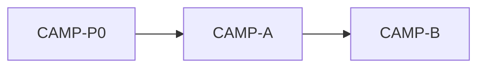

# IDEJE — CAMP-01 grupe pitanja

> [[ideje-camp|hub]] · freeze [[ideje-camp-pitanja|pitanja]] C1–C20 (2026-08-30).  
> **Kod šablon:** [[../06-production/plan-prompts-camp|plan-prompts-camp]] — **ne** 20 promptova.  
> Nije D0 blocker. Kanon arena spec se ne prepisuje dok „dodaj u scope“.

## Kako koristiti

1. Plan-agent čita **ovu** mapu + hub.
2. Copy-paste **jedan** prompt → novi chat → **Plan** → odobri → Agent.
3. Redoslijed: **CAMP-P0 → A → B**.
4. G3 se **ne** kodira; svaki prompt ponavlja „Ne dirati“.
5. **Ne spajati A i B.** Chrome nije spend.

## Mapa grupa

| Grupa | Pitanja u kodu | Prompti | Ovisi o |
|-------|----------------|---------|---------|
| **Docs** | C16 | **CAMP-P0** | — |
| **G1 Chrome** | C1 C2 C3 C4 C5 C6 C7 C15 C19 C20 | **CAMP-A** | P0 |
| **G2 Donate** | C8 C9 C10 C11 C12 C13 C14 | **CAMP-B ✅** | A (toast/companion/naslovi već) |
| **G3 Constraints** | C17 C18 | **nema** (citiraj u A i B) | — |

## G1 — Chrome

**Slice docs:** [[ideje-camp-chrome|chrome]].

### Freeze (jednom)

| # | Odluka |
|---|---------|
| C1 | StatusToast no-op / hidden. |
| C2 | Nema journal GardenCliff grane. |
| C20 | Nema T2 Sprinkler GardenCliff grane. |
| C7 | Ostali GardenCliff stringovi ostaju. |
| C3 | CrystalCliff cijeli sklonjen. |
| C5 C6 | Title Seeds / Flowers; UniqueName ostaju. |
| C4 | RunPrepCard van. |
| C15 C19 | Companion API + Pip u runu; nema camp pickera ni toasta. |

### Što kod radi

`camp_scene.tscn` + `camp_controller.gd` + `camp_layout_smoke.gd`.

A **ne** dira `try_upgrade_*` ni upgrade captione.

## G2 — Donate + copy

**Slice docs:** [[ideje-camp-donate|donate]].

### Freeze (jednom)

| # | Odluka |
|---|---------|
| C8 | 2× T3 Flowers za Sprinkler **i** Loot Boost. |
| C9 | Cost 2 po levelu. |
| C10 | Atomic tap; nema donated 1/2. |
| C11 | Select ≥2, else cheapest rarity ≥2. Nema 1+1. |
| C12 | Exchange ostaje. |
| C13 | Caption = efekat + Spend 2 flowers. |
| C14 | Nema SAVE_VERSION. |

### Što kod radi

`game_state.gd` spend + `try_upgrade_*` bez donation praga; `_refresh_upgrade_cards`; `ekonomija-brojevi.md` sink red; `camp_donate_smoke.gd`.

B **ne** dira naslove Seeds/Flowers, toast, RunPrep (već A).

## G3 — Constraints (ne kodirati)

| # | Pravilo |
|---|---------|
| C17 | Arena leftover / sort / overlay / grant — ruke dalje. |
| C18 | Home, Shop, AdMob, IAP — ruke dalje. |
| — | `donate_bloom` se ne oživljava. |
| — | `CAMP_BED_BONUS` se ne prepisuje. |
| — | Journal scene se ne dira. |

Citiraj „Ne dirati“ u A i B.

## Povezano

- [[ideje-camp|hub]] · [[../06-production/plan-prompts-camp|prompti]]
