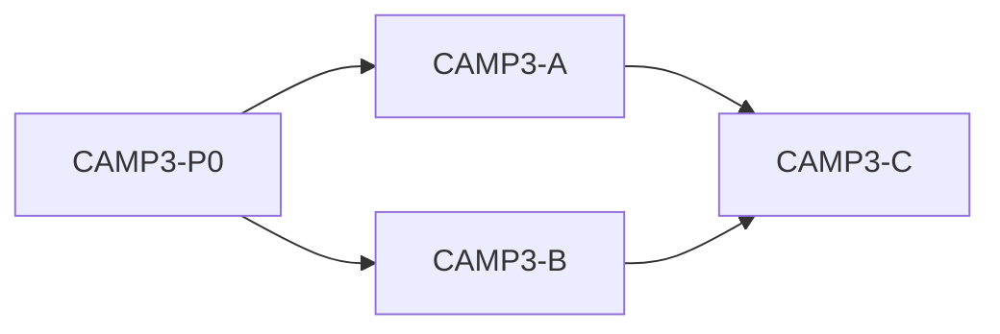

# IDEJE — CAMP-03 grupe pitanja

> [[ideje-camp-link|hub]] · freeze [[ideje-camp-link-pitanja|C22–C34]].  
> **Kod šablon:** [[../06-production/plan-prompts-home-camp-field|plan-prompts-home-camp-field]].  
> CAMP3-A čeka FIELD-D. CAMP3-C čeka A. B smije paralelno s A. Ne spajati A s FIELD-D.

## Kako koristiti

1. Plan-agent čita ovu mapu + hub.  
2. Jedan prompt → novi chat → Plan → Agent.  
3. Redoslijed kod: **A → B → C** (B smije uz A). Docs **CAMP3-P0** (s FIELD-P0) prvo.  
4. Ne pasteati CAMP2-A.

## Mapa grupa

| Grupa | Pitanja | Prompt | Ovisi o | Korisnik stavka |
|-------|---------|--------|---------|-----------------|
| **Docs** | C16 ostaje; C22–C34 freeze | **CAMP3-P0** | — | sve |
| **G1 Chrome** | C22–C27, C34 | **CAMP3-A ✅** | FIELD-D | naslovi, hide counts, +10% |
| **G2 Flowers** | C28–C30, C34 | **CAMP3-B ✅** | P0 | rarity + auto-select |
| **G3 Season** | C31–C34 | **CAMP3-C ✅** | A | next-lock → Home |

## G1 — Chrome ✅

GardenCliff/BagLabel/CrystalTotalLabel hidden. Seeds/Flowers. Scroll 242. UpgradeCards ostaju hidden.

## G2 — Flowers = Seeds ✅

rarity_bg. Auto-select. Ažurirati crystal smoke.

## G3 — Next-lock kartica ✅

Ista visina. Barovi + Unlock. Unlock = hub Home, ne `unlock_free`. Hidden ako nema next.

## Constraints

| Pravilo |
|---------|
| Ne Shop, AdMob, leftover/vacuum, SAVE_VERSION, Unlock JSON. |
| Ne vraćati Sprinkler/Loot UI u kamp. |
| Ne `unlock_free` iz kampa. |
| Ne spajati A s FIELD-D. |
| Ne pasteati CAMP2-A. |

## Povezano

- [[ideje-camp-link|hub]] · [[ideje-home-meadow-field-grupe|HOME-16 grupe]] · [[../06-production/plan-prompts-home-camp-field|prompti]]
