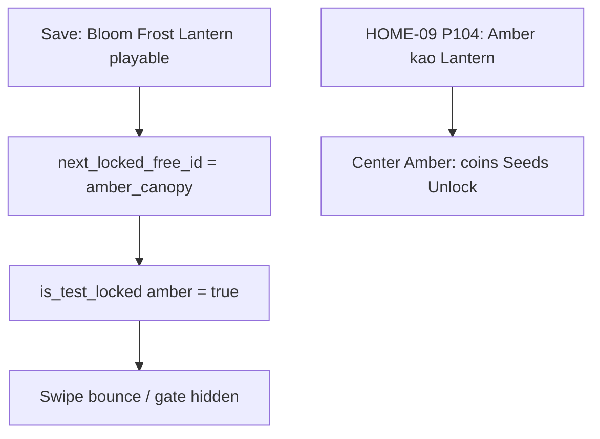

# IDEJE — Home cardfit (HOME-09 hub)

> **ID:** **HOME-09** · v1.1+ (nije v1 launch blocker).  
> **Kod:** **CARDFIT-A–B ✅**. Prompti: [[../06-production/plan-prompts-home-cardfit|plan-prompts-home-cardfit]] **CARDFIT-P0 → A → B** sve ✅.  
> **Chrome korekcija:** [[ideje-home-lockflow|HOME-10]] — roster clip lijevo + ellipsis; swipe wash lag; locked poster (ime + 500/20 + gold Unlock).  
> **Prethodnik:** [[ideje-home-incard|HOME-08]] INCARD-A–B ✅ — roster i Unlock **jesu** u hero-centar prozoru, ali playtest kaže da Unlock „nije napravljen“, ime više nije na sredini, roster je isti tamni okvir na svakoj sezoni, tekst ne staje.  
> **Pillar:** [[../01-vision/design-pillars|Fair F2P]] — coin Unlock i dalje samo lanac **free** sezona (next-lock). Paid (Moonlit / Coral / Starfall / Ember) **nema** coin Unlock. Ember ostaje paid TEST_LOCK / IAP.

## Pitch

HOME-08 je uradio pravi **prostor** (child `CenterSlot` / `PaidCenterSlot`) i ostavio tri stvari koje playtest vidi kao „nije gotovo“:

1. **Unlock gate se ne vidi na Amber Canopy.** Kod postoji — `%UnlockGate` je dijete `CenterFill`, trake coins/Seeds, gumb sivo→primary. Ali `is_test_locked_season("amber_canopy")` je `true` (P84). Swipe na Amber = bounce. `can_unlock_free(amber)` = uvijek false. `refresh_gate` traži `is_free_selectable` → Amber nikad nema trake. U saveu gdje su Bloom, Frost i Lantern već playable, **sljedeća zaključana free sezona je Amber** — i njoj je UI namjerno ugašen. Igrač misli da agent nije napravio INCARD-B. Nije bag clipanja. To je TEST_LOCK.
2. **Ime sezone nije na sredini.** INCARD-A (P100) je stavio `CenterTitle` gore (`vertical_alignment` TOP, `offset_bottom` 72). Prije HOME-08 ime je živjelo u sredini kartice. Playtest traži to natrag. Roster i gate ostaju overlay oko imena, ne guraju ga na vrh.
3. **Roster je isti tamni `1A1A14` na svakoj sezoni**, 260px širok. Na Country Bloom (svijetlo zeleno) okvir je OK-ish ali ne „odgovara“ sezoni. Na Moonlit Warren (tamno ljubičasto) cream tekst na gotovo crnom frameu nestaje u kartici. Duga imena (`Golden Oak Bloom`, `Paper Lantern Bloom`) idu u ellipsis. Treba: **druga sezona, druga pozadina prikaza cvijeća**, kontrast da se čita, **širi** panel.

Kod mora ostati razdvojen: **A Amber + gate vidljiv na next-lock free**, **B naslov + kontrast + širina**. Ne miješati TEST_LOCK logiku s chromeom u istom promptu.

## Dijagnoza — zašto Unlock „nije napravljen“

INCARD-B **jeste** u kodu:

- [`game/scripts/ui/season_unlock_gate.gd`](../../game/scripts/ui/season_unlock_gate.gd) — `refresh_gate(hero_id, free_is_hero)`
- [`game/scenes/ui/season_stage.tscn`](../../game/scenes/ui/season_stage.tscn) — `%UnlockGate` parent `CenterSlot/CenterFill`, sidro donji desni kut
- Gumb: `disabled` + `subtle` + `MOUSE_FILTER_IGNORE` dok `not can_unlock_free`; `primary` + `STOP` kad može

Uvjeti da se vidi:

1. `home_band != "paid"`
2. `strip_center_id() == next_locked_free_id()`
3. `is_free_selectable(hero_id)` — **false za Amber** jer `is_test_locked_season`
4. `not is_season_playable(hero_id)` — Amber i ovdje false zbog TEST_LOCK, ali selectable ga ionako ne pušta u centar (bounce)

`next_locked_free_id()` **ne** skipa TEST_LOCK. Ako je Lantern u `unlocked_seasons`, funkcija vraća `amber_canopy`. Gate bi trebao biti na Amber — ali selectable+TEST_LOCK ga gasi prije crtanja.

`debug_unlock_all_seasons` preskače `lantern_meadow` (DEBUG_SKIP) **i** sve `is_test_locked_season` (Amber + Ember). Tipičan editor save: Bloom+Frost playable, Lantern next-lock, gate namijenjen **Lanternu**. Korisnikov save: te sezone su već otključane → Lantern playable → Amber je next, a Amber je TEST_LOCK → **nema gatea nigdje**.

HOME-09 **ne** dodaje novi Unlock widget. Skida Amber s TEST_LOCK liste i ostavlja gate da radi za **svaku sljedeću zaključanu free** sezonu kad je ona hero-centar: Frost (novi save), Lantern (debug skip), Amber (ovaj save).

Ember Fen **ostaje** paid TEST_LOCK. Nema coin Unlock na paid (P54, P89, P105).

## Zašto sada

Playtest HOME-08: „nisi napravio Unlock na zaključanoj sezoni“, „ime mora biti na sredini kao prije“, „pozadina cvijeća treba kontrast po sezoni“, „tekst ne staje“. To su korekcije **istog** Home Stagea, ne novi feature-set. Ako agent samo posvijetli roster i ostavi Amber TEST_LOCK, Unlock i dalje „nije napravljen“ u saveu gdje je Lantern već otključan.

## Što HOME-08 **jest** vs što HOME-09 **overridea**

| HOME-08 (ostaje) | HOME-09 |
|------------------|---------|
| Roster child `CenterSlot` / `PaidCenterSlot`, donji lijevi kut | Ostaje; **širina i boja** override (P108, P109) |
| Gate child `CenterFill`, donji desni kut | Ostaje; **tko smije biti next-lock** override (P103, P104) |
| Veći tip: ikona ~52, ime ~22, zvijezde ~18, red ~56 | Ostaje |
| Unlock sivo→primary; Seeds = T3 count | Ostaje (P97, P98) |
| Paid roster da, coin Unlock ne | Ostaje (P113) |
| L/R i preview 20% bez rostera/gatea | Ostaje |
| P84 debug skip lantern; Amber/Ember TEST_LOCK | **Override P104:** Amber **nije** TEST_LOCK. Ember ostaje. Debug skip Lantern **i** Amber (P111) |
| P100 naslov gore | **Override P107:** naslov **sredina** kartice |
| P90 jedan tamni okvir za sve sezone | **Override P108:** frame iz `_mood_color`, kontrast po sezoni |

Puna tablica: [[ideje-home-cardfit-pitanja|pitanja]] P103–P114. P1–P102 ostaju osim overridea gore.

## Simptom vs cilj

| Danas (nakon HOME-08) | Cilj |
|-----------------------|------|
| Lantern otključan → Amber bounce, nema traka | Amber u centru: coins + Seeds + Unlock na **njenom** prozoru |
| Unlock sivo dok nema resursa — radi, ali samo na Lanternu | Isto stanje na **bilo kojoj** next-lock free (Frost / Lantern / Amber) |
| Ime sezone gore na kartici | Ime **na sredini** kao prije INCARD-A |
| Roster `1A1A14` na Bloom i na Moonlit | Bloom tamno-zeleni frame; Moonlit svijetli frame; kontrast da se čita |
| Roster 260px, ellipsis na dugim imenima | Širi panel (~0.42–0.50 širine kartice, min ~320px) |
| Ember bounce / IAP | Ember i dalje paid TEST_LOCK; **nema** coin Unlock |

## Što HOME-09 **jest**

- Skinuti `amber_canopy` s `is_test_locked_season`. Amber se ponaša kao Lantern: selectable kad je next-lock, `can_unlock_free` (220 coins / 12 T3 iz `seasons.json`), Unlock sivo dok nema resursa, primary kad ima.
- Gate ostaje na **hero-centru** next-lock free sezone — ne na Bloomu dok gledaš Bloom, ne na desnom previewu, ne na paid.
- Naslov sezone: full-rect Label, horizontal + vertical CENTER.
- Roster (i gate) pozadina iz postojećeg `_mood_color`: svijetle kartice → tamni frame + cream tekst; tamne kartice → svijetli frame + tamni tekst.
- Širi roster da imena stanu; `clip_contents` ostaje.

Detalj: [[ideje-home-cardfit-gate|gate]] · [[ideje-home-cardfit-naslov|naslov]] · [[ideje-home-cardfit-roster|roster]].

## Što HOME-09 **nije**

- Novi Unlock widget, novi sheet, coin Unlock na paid / Ember.
- Otključavanje Amber prije Lanterna (`can_unlock_free` i dalje traži prethodnu free).
- Roster na L/R side karticama ili preview 20%.
- Follow-finger, wrap, band 20/80, Shop Select, AdMob, SAVE_VERSION, inline IAP, hub pager.
- Mijenjanje 48 imena / rarity, `seed_type_ids`, L/R in-place pretapanja.
- Launch blocker. v1.1+.

## Agent

- Kad korisnik dira „Unlock nije na zaključanoj sezoni“, „Amber“, „ime na sredini“, „roster kontrast“, „tekst ne staje“ → **HOME-09**.
- Ne vraćati Stage overlay. Ne stavljati coin Unlock na Ember.
- Ne grantati lantern ni amber kroz `debug_unlock_all` (P111) — playtest treba locked free karticu.
- Ne miješati CARDFIT-A (TEST_LOCK + gate) i CARDFIT-B (naslov + boja + širina) u istom kod promptu.

## Povezano

- [[ideje-home-lockflow|HOME-10]] · [[ideje-home-barfit|HOME-11]] · [[ideje-home-incard|HOME-08]] · [[ideje-home-unlock|HOME-07]] · [[ideje-home-focus|HOME-06]]
- [[../06-production/CHECKPOINT|CHECKPOINT]] · [[../06-production/plan-prompts-home-cardfit|prompti]]
