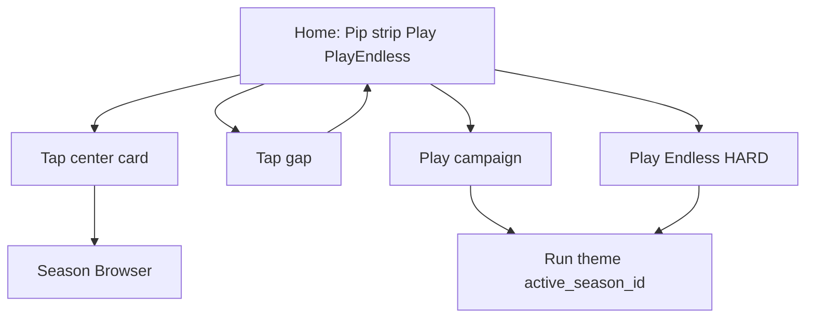

# IDEJE — Home chrome (HOME-03 hub)

> **ID:** **HOME-03** · v1.1+ (nije v1 launch blocker).  
> **Kod:** **CHROME-P0–C ✅**. Track zatvoren. Prompti: [[../06-production/plan-prompts-home-chrome|plan-prompts-home-chrome]].  
> **Prethodnik:** [[ideje-home-polish|HOME-01]] P0–C ✅, [[ideje-home-hit-targets|HOME-02]] HIT-A ✅.  
> **Pillar:** [[../01-vision/design-pillars|Fair F2P]] — Hard nije IAP; free traka i dalje **ne** prodaje snagu. Paid slotovi nisu na free traci (P16); zaseban PaidBand je [[ideje-home-paid|HOME-04]].

## Pitch

Home nakon HOME-01/02 ima **dobar raspored** (chest/basket, 3-slot traka, Play, Endless), ali **previše chromea** i **grub swipe**:

- Wordmark **Merge Meadow** + Pip — naslov je suvišan; Pip dovoljan.
- Label **Endless** između Play i Play Endless — dupli natpis.
- Red **Easy / Normal / Hard** — igrač ne treba birati; Endless je uvijek Hard.
- Tap u **praznini** trake otvara Browser — zbunjuje; Browser samo **okvir trenutne (srednje) sezone**.
- Prebacivanje sezona je **fade/blink**, ne klizanje. Struktura 3 slota ostaje; treba **smooth slide**.

Endless run već koristi **istu temu** kao Play (`active_season_id` spawn + BG). HOME-03 to **zaključava** u specu i gasi UI koji laže da Endless ima zasebnu teškoću/temu.

## Zašto sada

Playtest (HIT-A hit-through radi). Sljedeći osjećaj: **čišći Home**, **predvidiv Endless**, **fluidniji strip**. Mali kod, ali mora biti razdvojen (A chrome, B tap mapa, C tween) da agent ne spoji slide s brisanjem gumba u jednom krhkom PR-u.

## Simptom vs cilj

| Danas | Cilj |
|-------|------|
| Pip + "Merge Meadow" | Samo Pip (P36) |
| Play, "Endless", Play Endless, Easy/Normal/Hard | **Dva gumba:** Play, Play Endless (P37) |
| Endless Normal default + picker | Uvijek **Hard** krivulja (P38) |
| Endless spawn već sezona, UI to ne kaže | Tema = `active_season_id` kao Play (P39) |
| Gap tap = Browser | Gap = no-op; Browser **samo C** (P40–P41) |
| Snap = modulate fade | Slide ~220ms pa refresh (P42) |
| PlayThemeBadge mismatch | Ostaje (P43) |
| Endless skriven u tutorialu | Ostaje (P44) |

## Što HOME-03 **jest**

- Čišći `HomeColumn` chrome.
- Force Hard na endless start.
- Uža tap mapa Browsera (override P29).
- Vizualni strip slide (HBox wrapper / offset), HIT-A IGNORE invariant.

## Što HOME-03 **nije**

- Nije novi carousel, wrap, paid slot, Shop IAP, unique seeds.
- Nije brisanje Easy/Normal iz `RunLevelLibrary` (tools/smoke smiju ostati).
- Nije live follow-finger u prvom C (samo snap-slide).
- Nije Settings reduce-motion.
- Nije inline dropdown umjesto Season Browser.

## Odnos prema starim P

| Staro | HOME-03 |
|-------|---------|
| P18 compact Pip+title | Override: **Pip only** (P36) |
| P24 Endless ispod Play | Ostaje **pozicija**; nestaje naslov i difficulty |
| P29 gap = Browser | Override **P41** no-op |
| P19 centar = Browser | Ostaje, ali **samo C rect** (P40) |
| P21 badge | Ostaje (P43) |
| P23 ~180ms | C smije 200–280ms slide |
| P28 hit-through | Ostaje |

## Player loop

## Paket dokumenata

| Doc | Sadržaj |
|-----|---------|
| Ovaj hub | Pitch, scope |
| [[ideje-home-chrome-layout\|layout]] | Nodeovi, dva gumba, Pip |
| [[ideje-home-chrome-endless\|endless]] | Hard 85, tema, HUD |
| [[ideje-home-chrome-gesta\|gesta]] | Tap mapa + slide |
| [[ideje-home-chrome-pitanja\|pitanja]] | P36–P44 |
| [[../06-production/plan-prompts-home-chrome\|prompti]] | P0 → A → B → C |

## Agent

- **CHROME-C ✅.** Dalje D0-P playtest, ili [[ideje-home-paid|HOME-04]] PAID-A (Shop/dual-band).

## Povezano

- [[ideje-home-polish|HOME-01]] · [[ideje-home-hit-targets|HOME-02]] · [[ideje-home-paid|HOME-04]]
- [[../06-production/CHECKPOINT|CHECKPOINT]]
