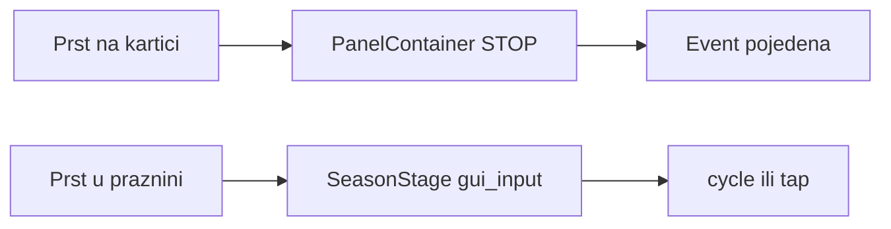
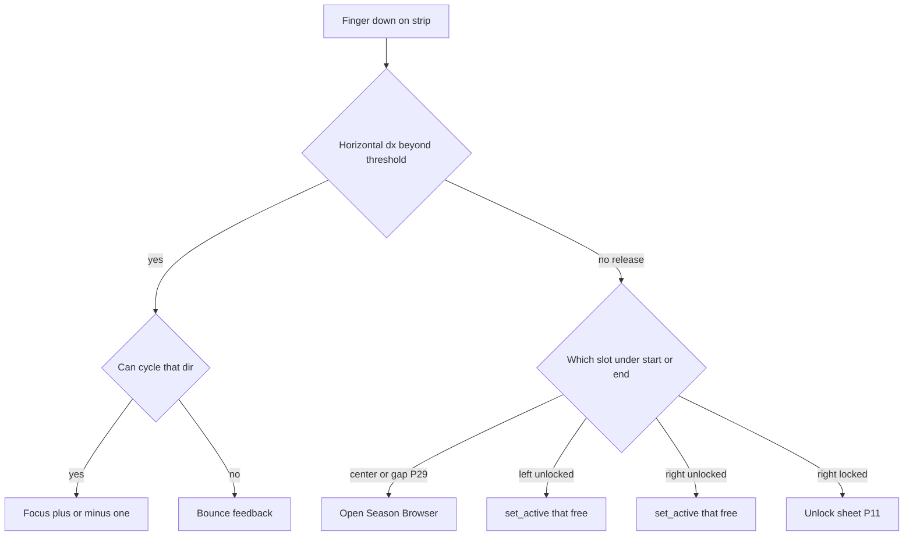

# IDEJE — Home hit targets (HOME-02 hub)

> **ID:** **HOME-02** · v1.1+ (nije v1 launch blocker).  
> **Kod:** **HIT-P0 ✅** (docs). **HIT-A ✅** — `Row` IGNORE, Stage STOP. Prompti: [[../06-production/plan-prompts-home-hit-targets|plan-prompts-home-hit-targets]].  
> **Slijedi:** [[ideje-home-chrome|HOME-03]] chrome / Endless Hard / strip slide.  
> **Prethodnik:** [[ideje-home-polish|HOME-01]] P0–C ✅ (flatten Home, 3-slot free traka, Play badge).  
> **Pillar:** [[../01-vision/design-pillars|Fair F2P]] — ovo je **gesta / hit-test**, ne shop, ne snaga, ne paid na traci.

## Pitch

Home traka sezona treba biti **jedno fluidno polje**: vidiš tri kartice, staviš prst **bilo gdje na njih** (ili između), i igra razumije:

- **Povlačenje lijevo/desno** = pomakni free lanac (ako smiješ), inače bounce.
- **Kratki tap na srednju karticu** = otvori **Season Browser** (free lista + **paid dolje**).
- **Kratki tap na bočnu karticu** = ta sezona postane **trenutna** ako je otključana; locked desno i dalje **Unlock sheet** (P11).

Danas to **nije** tako. Paneli sezona **blokiraju** swipe. Swipe (i smislen tap) rade skoro samo u **rupama** oko panela. Srednja kartica **nije** klikabilna. Bočne nisu ni swipeable ni tap-select. Hub djeluje **krut**: moraš pogoditi tanki razmak. To zbunjuje i osjeća se kao bug, ne kao dizajn.

HOME-02 **ne** mijenja što swipe/tap **znače**. To je već **P19** iz HOME-01 i već je napisano u `season_stage.gd` (`_handle_tap`, `cycle_free_strip`). HOME-02 popravlja **tko prima prst**.

## Zašto sada

HOME-01 je zatvorio layout (nema Panel-prozora) i 3-slot carousel. Playtest odmah pokazuje da je **input mapa** kriva: vizual kaže „ovo je traka“, hit-test kaže „traka je samo praznina između panela“. Dok to nije popravljeno, swipe S1–S3 u debugu ostaje **grub** čak i kad su sve sezone otključane.

Ovo je mali kod-korak (HIT-A), ali mora biti **dokumentiran opširno** da agent ne „popravi“ krivu stvar: npr. da ne doda gumb na svaki slot koji jede swipe, ili da ne otvori Browser na tap boka.

## Simptom (playtest)

| Što igrač pokuša | Što se dogodi danas | Što treba |
|------------------|---------------------|-----------|
| Swipe preko **srednje** kartice | Ništa / hub page swipe / dead zone | Cycle free strip (P16/P20/P23) |
| Tap srednje kartice | Ništa | Season Browser (free + paid dolje) |
| Swipe preko **lijeve/desne** kartice | Ništa | Isti cycle kao swipe u praznini |
| Tap lijeve/desne **otključane** | Ništa | Ta sezona u centar + `set_active` |
| Tap desne **zaključane** | Ništa (ako je prst na panelu) | Unlock sheet P11 |
| Swipe u **praznini** između panela | Radi (slučajno) | I dalje radi, ali **nije** jedini hit |

Igrač zaključuje: „sezone nisu klikabilne; swipe je slomljen osim kad promasim karticu.“ To je suprotno od cilja HOME-01 („jedno jasno swipe polje“).

## Uzrok (jedna rečenica, detalj u tehnika docu)

Godot `Control` djeca s `mouse_filter = STOP` (u `.tscn` vrijednost `0`) **pojednu** `gui_input` prije roditelja. `SeasonStage` sluša samo **svoj** `gui_input`. `LeftSlot` / `CenterSlot` / `RightSlot` i njihovi `Label`i su STOP. Event na rectu kartice **nikad** ne dođe do `_on_stage_gui_input`. `_handle_tap` koji već radi hit-test `get_global_rect()` na slotovima **nikad se ne pozove** za prst koji je počeo na panelu.

## Odnos prema HOME-01 / P19

| HOME-01 | HOME-02 |
|---------|---------|
| P16 free-only strip | **Ostaje.** Paid i dalje nisu kartice. |
| P17 kill Panel | Već u kodu. Ne dirati. |
| P19 tap mapa | **Ostaje semantika.** HOME-02 čini da mapa **stvarno pogađa** kartice. |
| P20 no wrap | Ostaje. |
| P21 Play badge | Ostaje. |
| P23 snap/bounce | Ostaje; bounce i dalje modulate fade ako HBox pregazi `position`. |
| Layout veličine P22 | Ostaje. Nije art pass. |

HOME-01 hub i carousel **opisuju** geste „u rectu trake“. Nisu rekli eksplicitno: „djeca moraju biti IGNORE.“ Zato playtest padne iako je `_handle_tap` ispravan.

## Cilj osjećaja

1. Traka je **mekana**: prst ne traži šav između kartica.
2. **Isto polje** je i swipe i tap (razlikuje se pragom ~20 px, P30).
3. Sredina = **katalog** (Browser), ne Play (Play gumb je dolje).
4. Bokovi = **prečac** na tu sezonu ako smiješ igrati tu free temu; locked desno = **zašto je lock** (sheet), ne mrtav klik.
5. Hub swipe (Shop ↔ Home ↔ Camp) **ne** krade horizontalni swipe dok je prst na traci (`block_hub_swipe` na Stageu). Kad je Browser/sheet otvoren, **oni** hvataju prst (P32).

## Što HOME-02 **jest**

- Hit-through: cijeli vizual trake (L + C + R + gapovi) ide u **isti** Stage handler.
- Dokumentacija geste (svaki start-rect × tap/swipe × locked).
- Godot `mouse_filter` pravilo + fallback ako IGNORE nije dovoljan.
- Jedan kod prompt **HIT-A**.
- Pitanja **P28–P35** (defaulti dovoljni za kod).

## Što HOME-02 **nije**

- Nije novi carousel, nije wrap, nije paid slot na **free** traci (PaidBand = [[ideje-home-paid|HOME-04]]).
- Nije novi Browser UI / inline dropdown umjesto postojećeg overlaya (**P34**).
- Nije Shop IAP redovi, unique seed ID-evi, Play Console, final thumbnail art.
- Nije mijenjanje `debug_unlock_all_seasons` / smoke skip.
- Nije „centar tap = Play“.
- Nije da tap na bok otvara Browser.

## Player loop (samo input)

Točka „under start or end“ za tap: HIT-A default = **pozicija na release** u `_end_press` (već `pos` u `_handle_tap`). Ne uvoditi drugi hit-test dok playtest ne pokaže da je krivo.

## DoD osjećaja (nakon HIT-A, nije ovaj P0)

- Swipe **počevši na** srednjoj kartici mijenja sezonu (kad S2/S3 unlocked).
- Swipe **počevši na** lijevoj ili desnoj kartici isto.
- Tap sredine otvara Browser; vidiš paid red dolje.
- Tap otključanog boka prebacuje tu sezonu u centar.
- Tap locked desno otvara sheet, ne Browser.
- Play, chest, basket, hub page swipe **izvan** Stage recta rade kao prije.

## Paket dokumenata

| Doc | Sadržaj |
|-----|---------|
| Ovaj hub | Pitch, simptom, uzrok, scope |
| [[ideje-home-hit-targets-gesta\|gesta]] | Puna matrica start-rect × gesta |
| [[ideje-home-hit-targets-tehnika\|tehnika]] | `mouse_filter`, bubbling, fallback, smoke |
| [[ideje-home-hit-targets-pitanja\|pitanja]] | P28–P35 defaulti |
| [[../06-production/plan-prompts-home-hit-targets\|prompti]] | HIT-P0 → HIT-A |

## Agent / produkcija

- **HIT-A ✅.** Dalje D0-P playtest. Kad `season_stage` input opet pukne: vidi katalog #13.

## Povezano

- [[ideje-home-polish|HOME-01]] · [[ideje-home-polish-pitanja|P16–P27]]
- [[ideje-sezone-ux-home|SEZ-C Browser/sheet]]
- [[../06-production/CHECKPOINT|CHECKPOINT]]
- [[../06-production/scope-i-granice|scope]]
