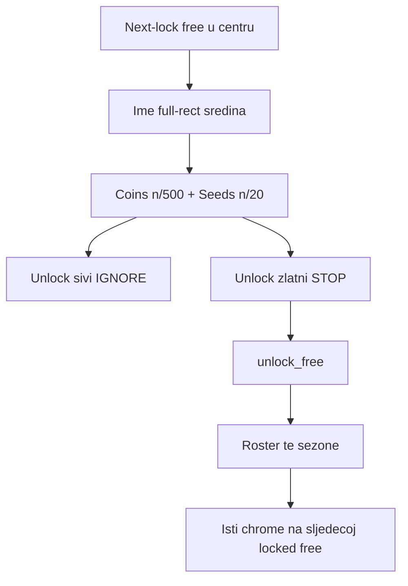

# IDEJE — Home lockflow (HOME-10 hub)

> **ID:** **HOME-10** · v1.1+ (nije v1 launch blocker).  
> **Kod:** **LOCKFLOW-A ✅** · **LOCKFLOW-B ✅**. Prompti: [[../06-production/plan-prompts-home-lockflow|plan-prompts-home-lockflow]] **LOCKFLOW-P0 → A → B**.  
> **Chrome korekcija:** [[ideje-home-barfit|HOME-11]] — barovi prekrivaju 🔒+ime; skini gate okvir; debug 500 coins.  
> **Prethodnik:** [[ideje-home-cardfit|HOME-09]] CARDFIT-A–B ✅ — Amber više nije TEST_LOCK, ime je na sredini, roster ima per-season frame, ali playtest kaže da **prikaz cvijeća nije dobar**, imena i dalje idu u `...`, boja panela **kasni** na swipe, a zaključana free sezona **nije** „ime + dva bara + Unlock“.  
> **Pillar:** [[../01-vision/design-pillars|Fair F2P]] — coin Unlock i dalje samo lanac **free** sezona (next-lock). Paid nema coin Unlock. Ember ostaje paid TEST_LOCK / IAP.

## Pitch

HOME-09 je zatvorio TEST_LOCK na Amberu i vratio ime u sredinu. Playtest nakon CARDFIT-B vidi **tri stvari koje i dalje nisu gotove**, plus jednu stvar koju igrač želi **jednom za svagda** objasniti: kako zaključana free sezona izgleda i kako se otključava.

1. **Prikaz liste cvijeća nije dobar.** Roster „biježi lijevo“, ikone se ne vide, `CenterSlot.clip_contents` reže lijevi rub. CARDFIT-B je podigao `custom_minimum_size.x` na 320, ali `anchor_right` je ostao **0.48** — min širina pobjeđuje sidro i Control raste u negativan x.
2. **Imena cvijeća i dalje imaju tri točkice.** `Paper Lantern Bloom`, `Golden Oak Bloom`, `Dusk Firefly Grass` ne stanu. Playtest: **puno ime, bez ellipsisa.** Raširiti prikaz **desno** (gate više ne drži desni kut na otključanoj kartici).
3. **Boja pozadine prikaza kasni na swipe.** Kartica already mijenja mood na morph midpoint; opaque darkened frame (`FRAME_ALPHA` 0.88) ostaje stare sezone do kraja tweenea. Izgleda kao glitch. Smjer: **blaga, transparentna** pozadina da kroz nju već sja boja kartice.
4. **Zaključana free sezona nije poster s progresom.** Danas gate živi u donjem desnom kutu, pored rostera, Unlock je `subtle`→`primary` (breskva, nije zlato), trošak je 80/5 · 150/8 · 220/12. Playtest želi: **ime na sredini**, **ispod** dva bara (Coins 500, Seeds 20 bilo kojeg T3), **Unlock** sivi dok barovi nisu puni, **zlatni i klikabilan** kad jesu. Tap → sezona otključana → barovi i gumb nestaju → **roster te sezone**. Isti princip prelazi na sljedeću locked free (Lantern → Amber → …).

Lantern Meadow i Amber Canopy ostaju **zaključane** za playtest. **Ne** `is_test_locked_season` — to bounce-a swipe i gasi gate (HOME-09 dijagnoza). One su next-lock lanac: selectable, `can_unlock_free` kad ima 500c/20 T3.

Kod mora ostati razdvojen: **A lock flow** (500/20, gate stupac, gold, hide roster, fixture), **B roster chrome** (širina desno, no ellipsis, wash, midpoint). Ne miješati JSON troškove s clip mathom u istom promptu.

## Dijagnoza — zašto roster biježi lijevo

U [`season_stage.tscn`](../../game/scenes/ui/season_stage.tscn) `FreeRoster` / `PaidRoster` (nakon CARDFIT-B):

| Property | Vrijednost | Efekt |
|----------|------------|--------|
| `custom_minimum_size` | `(320, 348)` | Godot **ne smije** nacrtati uži panel |
| `anchor_right` | `0.48` | Dodijeljena širina ≈ **0.48 × CenterFill − 16** |
| `offset_left` / `offset_right` | `8` / `-8` | još −16 px |
| `grow_horizontal` | `2` (both) | višak raste oba smjera |
| Parent `CenterSlot` | `clip_contents = true` | sve lijevo od 0 se **reže** |

Na tipičnom hero Fillu (~360–420 px) sidro daje **~160–190 px**. Min 320 je **veći**. Control raste; desni rub je zaključan blizu 0.48 (i gate drži desni kut `offset_left = -228`), pa višak ide **lijevo** u negativan x. Ikone (prvi child HBoxa) nestaju iz clipa. Name label dobije uzak sliver → [`OVERRUN_TRIM_ELLIPSIS`](../../game/scripts/ui/season_roster_panel.gd). Igrač vidi „nema cvijeća“ i `Harvest Pumpk...`.

CARDFIT-B P109 (`~0.42–0.50` / min 320) je **pogoršao** clip: prije je min bio 260, pa je overflow bio manji. Širina se mora riješiti **sidrom desno**, ne većim minom na uskom sidru.

HOME-10 to rješava **dva puta**:

- **Locked kartica:** roster je **skriven**. Gate više nije konkurent za desni kut.
- **Unlocked kartica:** gate je skriven. Roster smije `anchor_right` ~**0.78–0.88**, min ~**380–420**, bez negativnog x.

## Dijagnoza — zašto boja kasni

L/R in-place morph u [`season_stage.gd`](../../game/scripts/ui/season_stage.gd):

```
_play_inplace_morph → fade out → midpoint _apply_free_cycle
    cycle_free_strip + _fill_free_slots()     ← mood kartice NOVI
→ fade in → _finish_free_morph → refresh()
    _refresh_roster() → apply_season           ← StyleBox NOVI tek sad
```

[`season_card_contrast.gd`](../../game/scripts/ui/season_card_contrast.gd) `FRAME_ALPHA = 0.88` + `darkened(0.55)` je **gotovo neprozirna** naljepnica. Pola tweenea: Bloom karta već jantar, roster još tamno-mint. To je glitch, nije „tvrdi kontrast“.

Playtest smjer: **niska alpha wash** mooda (0.20–0.35) da kroz panel već sja boja kartice — swipe izgleda kao ista porodica boja, ne kao zamjena HUD-a. Uz to B zove `apply_season` na **midpointu**, ne čeka kraj.

## Dijagnoza — zašto Unlock nije „ime + barovi + gumb“

Widget **postoji** ([`season_unlock_gate.gd`](../../game/scripts/ui/season_unlock_gate.gd)). Layout i brojevi nisu playtest:

| Danas (CARDFIT-B) | Playtest |
|-------------------|----------|
| Gate **donji desni** kut (`anchors_preset` 3, 220×168) | Stupac **ispod imena**, donja **polovica**, horizontalno centriran |
| Roster **vidljiv** i na locked (dijele karticu) | Roster **skriven** dok je locked; nakon Unlock roster kao na Bloomu |
| Unlock `subtle` → `primary` (breskva iz `UiPalette`) | Sivi dok barovi nisu puni; **zlatni** + klikabilan kad jesu |
| Frost 80/5, Lantern 150/8, Amber 220/12 | **500 coins + 20 bilo kojeg T3** za sve preostale free |
| Ime full-rect centar (CARDFIT-B) — OK | **Ostaje.** Barovi ne guraju ime gore (P100 je odbijen) |

Lanac: `next_locked_free_id()` + `can_unlock_free` sequential **ostaje**. Nije novi widget. Nije sheet. Nije TEST_LOCK na Lantern/Amber.



## Zašto sada

Playtest nakon CARDFIT-B: „prikaz cvijeća nije dobar, biježi lijevo“, „tri točkice ne smiju“, „boja kasni dok swipeam“, „Lantern i Amber zaključane“, „ime, dva bara, Unlock sivi pa zlatni, pa roster, pa isto na sljedećoj“. To je **isti** Home Stage i isti `unlock_free` lanac — korekcija prostora, troška i chromea, ne novi feature-set.

Ako agent samo podigne `anchor_right` i ostavi gate dolje-desno pored rostera, locked kartica i dalje nije poster. Ako samo preboji Unlock u zlato i ostavi clip, cvijeće se i dalje ne vidi. **A pa B.**

## Što HOME-09 **jest** vs što HOME-10 **overridea**

| HOME-09 (ostaje) | HOME-10 |
|------------------|---------|
| Amber **nije** TEST_LOCK; Ember **jest** | Ostaje (P104/P105/P124). Ne vraćati Amber/Lantern na TEST_LOCK |
| `can_unlock_free` sequential | Ostaje (P106/P120) |
| Naslov full-rect H+V CENTER | Ostaje (P107). Barovi **ispod** imena, ne guraju ga gore |
| Frame iz mood palete, luminance tekst | Ostaje algoritam; **alpha** override (P122 wash) |
| Debug skip Lantern **i** Amber po id-u | Ostaje (P111/P127) |
| Gate child `CenterFill`, `z_index` 1 | Ostaje parent; **sidro** override (P115) — ne donji desni |
| Roster child Fill, donji lijevi, 6 redova, ikona 52 / font 22 | Ostaje parent + tip; **širina, clip, ellipsis, vidljivost na locked** override |
| Unlock sivo→primary; JSON 80/5 · 150/8 · 220/12 | **Override P117/P118:** 500/20; sivo→**gold** |
| Roster + gate na locked kartici zajedno | **Override P116:** roster skriven dok gate vidljiv |
| Roster `anchor_right` 0.48 / min 320 | **Override P121:** ~0.78–0.88, min da sidro pobijedi min |

Puna tablica: [[ideje-home-lockflow-pitanja|pitanja]] P115–P128. P1–P114 ostaju osim overridea gore.

## Simptom vs cilj

| Danas (nakon HOME-09) | Cilj |
|-----------------------|------|
| Roster reže lijevo, ikone nestaju | Sidro šire desno; nema negativnog x; ikone u clipu |
| `Golden Oak Bloom` → `Golden Oak B...` | Puno ime; autowrap 2 reda ako treba, **ne** ellipsis |
| Swipe: stari tamni frame na novoj kartici | Blaga transparentna wash; `apply_season` na midpointu |
| Gate dolje-desno pored rostera | Ime sredina; barovi + Unlock donja polovica, centrirano |
| Unlock breskva (`primary`) | Sivi dok nije spreman; **zlato** kad jeste (kontrast na jantaru) |
| Lantern 150/8, Amber 220/12 | **500 / 20 T3** za Frost, Lantern, Amber |
| Roster na locked i unlocked | Locked = samo ime+barovi+gumb; unlocked = ime+roster |
| Debug skip ostavlja Lantern locked — OK | Lantern **i** Amber locked; **nije** TEST_LOCK |

## Što HOME-10 **jest**

- Jednom za svagda: **prva zaključana free** u hero-centru nosi ime (sredina) + Coins bar + Seeds bar + Unlock. Gumb sivi dok oba bara nisu puna; zlatni i klikabilan kad jesu. Tap otključava; chrome nestaje; roster te sezone. Isti chrome prelazi na sljedeću locked free.
- Playtest fixture: **Lantern Meadow** i **Amber Canopy** nisu u `unlocked_seasons` (debug skip + A smije debug-strip). Nisu TEST_LOCK. Bloom + Frost playable → next-lock = Lantern.
- Trošak **500 coins + 20 bilo kojeg T3** u `seasons.json` za preostale free. UI čita `SeasonDef`, ne magične brojeve.
- Roster na otključanoj kartici širi **desno**, puna imena, blaga transparentna pozadina, boja se ažurira na morph midpointu.

Detalj: [[ideje-home-lockflow-gate|gate]] · [[ideje-home-lockflow-roster|roster]].

## Što HOME-10 **nije**

- Novi Unlock widget, novi sheet, coin Unlock na paid / Ember.
- TEST_LOCK na `lantern_meadow` / `amber_canopy` (to bounce-a i gasi gate).
- Otključavanje Amber prije Lanterna.
- Roster na L/R side karticama ili preview 20%.
- Follow-finger, wrap, band 20/80, Shop Select, AdMob, SAVE_VERSION, inline IAP, hub pager.
- Mijenjanje 48 imena / rarity, `seed_type_ids`, L/R in-place (osim poziva `apply_season` na midpointu).
- Slijepo brisanje produkcijskog `user://player_save.json`.
- Launch blocker. v1.1+.

## Agent

- Kad korisnik dira „zaključana sezona“, „Unlock sivi pa zlatni“, „500 coins“, „Lantern/Amber locked“, „roster biježi lijevo“, „tri točkice“, „boja kasni na swipe“ → **HOME-10**.
- Kad korisnik dira „barovi prekrivaju ime/katanac“, „spusti barove“, „skini okvir“, „500 coins da testiram Unlock“ → **HOME-11**.
- Ne vraćati Amber/Lantern na `is_test_locked_season`. Ne stavljati coin Unlock na Ember.
- Ne grantati lantern ni amber kroz `debug_unlock_all`.
- Ne miješati LOCKFLOW-A (flow + 500/20 + gold + hide roster) i LOCKFLOW-B (širina + wash + midpoint) u istom kod promptu.
- Ne vraćati naslov gore da „oslobodi“ barove.

## Povezano

- [[ideje-home-barfit|HOME-11]] · [[ideje-home-cardfit|HOME-09]] · [[ideje-home-incard|HOME-08]] · [[ideje-home-unlock|HOME-07]]
- [[../06-production/CHECKPOINT|CHECKPOINT]] · [[../06-production/plan-prompts-home-lockflow|prompti]]
