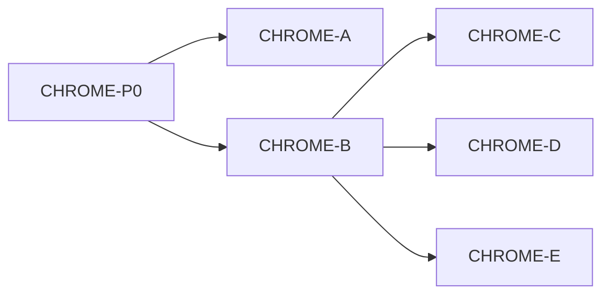

# IDEJE — HOME-13 grupe pitanja

> [[ideje-home-meadow-chrome|hub]] · freeze [[ideje-home-meadow-chrome-pitanja|P159–P178]].  
> **Kod šablon:** [[../06-production/plan-prompts-home-meadow-chrome|plan-prompts-home-meadow-chrome]].  
> Ne spajati A–E. Ne CAMP-02. Ne SEED kod. Ne 8 scena.

## Kako koristiti

1. Plan-agent čita ovu mapu + hub.  
2. Jedan prompt → novi chat → Plan → Agent.  
3. Redoslijed kod: **A ✅ → B ✅ → C ✅ → D ✅ → E ✅**. Docs **CHROME-P0** već ✅.  
4. G4 citiraj „Ne dirati“.

## Mapa grupa

| Grupa | Pitanja | Prompt | Ovisi o | Korisnik stavka |
|-------|---------|--------|---------|-----------------|
| **Docs** | P176–P178 | **CHROME-P0** ✅ | — | sve |
| **G1 Pip** | P159 P160 | **CHROME-A ✅** | P0 | 4 |
| **G2 Bleed** | P161–P163 | **CHROME-B ✅** | P0 (A smije prije) | 5 |
| **G3 Basket** | P164–P168 | **CHROME-C ✅** | B | 1 |
| **G4 Endless** | P169–P171 | **CHROME-D ✅** | B | 2 |
| **G5 Nav** | P172–P174 | **CHROME-E ✅** | B | 6 |
| **G6** | P178 | **nema** | — | — |

P175 (Play dual) svi prompti poštuju, ne reimplementiraju.

A ne čeka B. C/D/E čekaju B (Play sjedi na tintu).

## G1 — Pip

Sakriti `%PipPortrait`. `%MeadowPip` hidden + stop wander. UniqueName ostaje.

## G2 — Full-bleed

MainMenu tint iza Daily / Settings / Play. Karusel = stari bg.

## G3 — Basket ✅

Van s karusela; u polju lijevo od Play; season filter; T3; clear van poola.

## G4 — Endless ✅

Samo u polju; Hard; spawn = field id.

## G5 — Nav ✅

Name chip; system Back; SeasonsButton hide.

## G6 — Constraints

| Pravilo |
|---------|
| Ne `frost_field.tscn` / N scena. |
| Ne Shop, AdMob, Unlock JSON, leftover/vacuum rewrite, CAMP-01, CAMP-02, SAVE_VERSION, hub pager. |
| Ne `merge_arena_controller`, run `pip_visual` / `player.gd` / ArenaPip. |
| Ne flower slotovi/count (MEADOW-B). JSON pool = SEED-01, ne ovaj track. |

## Povezano

- [[ideje-home-meadow-chrome|hub]] · [[ideje-home-meadow|HOME-12]] · [[../06-production/plan-prompts-home-meadow-chrome|prompti]]
