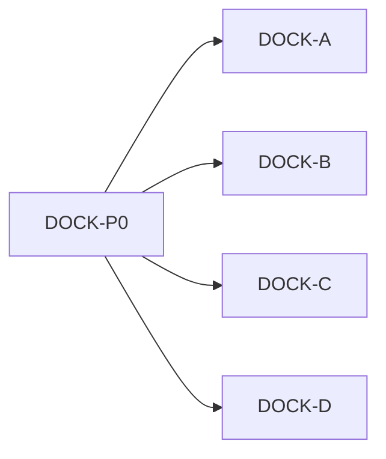

# IDEJE — HOME-15 grupe pitanja

> [[ideje-home-meadow-dock|hub]] · freeze [[ideje-home-meadow-dock-pitanja|P197–P214]].  
> **Kod šablon:** [[../06-production/plan-prompts-home-meadow-dock|plan-prompts-home-meadow-dock]].  
> Ne spajati A+C. Ne LIFE/CHROME kod. Ne CAMP. Ne 8 scena.

## Kako koristiti

1. Plan-agent čita ovu mapu + hub.  
2. Jedan prompt → novi chat → Plan → Agent.  
3. Redoslijed kod: **A → B → C → D**. Docs **DOCK-P0** prvo.  
4. A i D neovisni. B smije poslije A (isti T3 draw). **C ne spajati s A**.

## Mapa grupa

| Grupa | Pitanja | Prompt | Ovisi o | Korisnik stavka |
|-------|---------|--------|---------|-----------------|
| **Docs** | P207 | **DOCK-P0** | — | sve |
| **G1 Picker** | P201–P203, P208–P209 | **DOCK-A ✅** | P0 | T3 ikona, ★3, footer |
| **G2 Match** | P204, P210 | **DOCK-B ✅** | P0 (A smije) | polje = basket T3 |
| **G3 Layout** | P197–P200, P205, P211–P213 | **DOCK-C ✅** | P0 | Basket/Daily/Seasons/chip |
| **G4 Daily** | P206, P214 | **DOCK-D ✅** | P0 | streak van Home chesta |

A i D ne čekaju C. B smije poslije A.

## G1 — Picker ✅

T3 ikona iznad imena. ★3 u listi. Clear+Close stacked ispod scrolla. Ne micati BasketCard.

## G2 — T3 match ✅

Meadow `plant_tier = 3`. BasketVisual ostaje T3. Count 12–14. Ne PlayRow.

## G3 — Layout + Seasons ✅

Basket u HomeTopStack ispod Daily. Seasons u PlayRow. Chip ne close. `meadow_safe_rect` + Basket. HomeColumn `offset_top`.

## G4 — Daily ✅

Home caption bez arena linije. Tap ne `claim_arena_daily`. Arena HUD ostaje u areni.

## Constraints

| Pravilo |
|---------|
| Ne `frost_field.tscn` / N scena. |
| Ne Shop, AdMob, Unlock JSON, leftover/vacuum rewrite, CAMP-01, CAMP-02, SAVE_VERSION, hub pager. |
| Ne Pip FSM, Play 3-koraka, Endless Hard, SeedCatalog JSON. |
| Ne brisati `arena_daily_*` iz savea. |
| Ne spajati A+C. |

## Povezano

- [[ideje-home-meadow-dock|hub]] · [[ideje-home-meadow-life|HOME-14]] · [[../06-production/plan-prompts-home-meadow-dock|prompti]]
