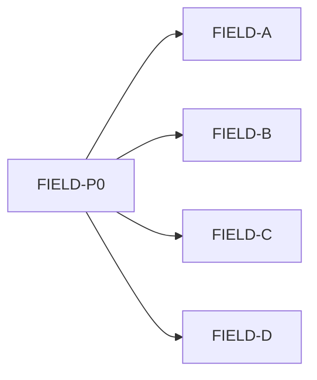

# IDEJE — HOME-16 grupe pitanja

> [[ideje-home-meadow-field|hub]] · freeze [[ideje-home-meadow-field-pitanja|P215–P232]].  
> **Kod šablon:** [[../06-production/plan-prompts-home-camp-field|plan-prompts-home-camp-field]].  
> Ne spajati FIELD-D + CAMP3-A. Ne DOCK/LIFE/CHROME kod. Ne 8 scena.

## Kako koristiti

1. Plan-agent čita ovu mapu + hub.  
2. Jedan prompt → novi chat → Plan → Agent.  
3. Redoslijed kod: **A → B → C → D**. Docs **FIELD-P0** (s CAMP3-P0) prvo.  
4. A, B, C neovisni. **D prije CAMP3-A**.

## Mapa grupa

| Grupa | Pitanja | Prompt | Ovisi o | Korisnik stavka |
|-------|---------|--------|---------|-----------------|
| **Docs** | P230 | **FIELD-P0** | — | sve |
| **G1 Daily** | P215–P217, P231 | **FIELD-A ✅** | P0 | overlay body |
| **G2 Basket** | P218–P220, P231 | **FIELD-B ✅** | P0 | no-scroll, jedan stupac |
| **G3 Swipe** | P221–P224, P232 | **FIELD-C ✅** | P0 | hub pager u polju |
| **G4 Upgrades** | P225–P229, P232 | **FIELD-D ✅** | P0 (C smije) | Magnet/Loot na polju |

A/B/C ne čekaju D. D smije poslije C (chrome grupa).

## G1 — Daily overlay ✅

Title Come back tomorrow; body bez eha. Caption P206 ostaje.

## G2 — Basket no-scroll

Jedan stupac; panel raste; DOCK-A T3/★3/footer ostaju.

## G3 — Hub swipe u polju ✅

Karusel Stage blokira. Polje: Stage ne, chrome da. Session field ostaje open.

## G4 — Magnet / Loot ✅

Kamp UpgradeCards hidden. Polje UR stacked. Spend 2 T3. Safe rect +.

## Constraints

| Pravilo |
|---------|
| Ne `frost_field.tscn` / N scena. |
| Ne Shop, AdMob, Unlock JSON, leftover/vacuum rewrite, SAVE_VERSION. |
| Ne Pip FSM, Play 3-koraka, Endless Hard, SeedCatalog JSON. |
| Ne CAMP3 Seeds naslovi / +10% / next-lock u FIELD promptima (osim hide UpgradeCards u D). |
| Ne spajati D s CAMP3-A. |

## Povezano

- [[ideje-home-meadow-field|hub]] · [[ideje-camp-link-grupe|CAMP-03 grupe]] · [[../06-production/plan-prompts-home-camp-field|prompti]]
