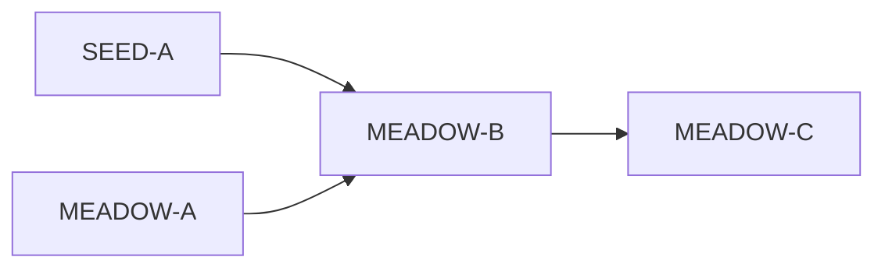

# IDEJE — HOME-12 grupe pitanja

> [[ideje-home-meadow|hub]] · freeze [[ideje-home-meadow-pitanja|P137–P158]].  
> **Kod šablon:** [[../06-production/plan-prompts-home-meadow|plan-prompts-home-meadow]] (HOME-12). Chrome sljedeće: [[../06-production/plan-prompts-home-meadow-chrome|HOME-13]].  
> **SEED-A prije MEADOW-B.** Ne spajati A/B/C. Ne CAMP-02. Ne 8 scena.

## Kako koristiti

1. Plan-agent čita ovu mapu + hub.  
2. Jedan prompt → novi chat → Plan → Agent.  
3. Redoslijed kod: **SEED-A** (katalog) pa **MEADOW-A → B → C**. Docs MEADOW-P0 već ✅.  
4. G4 citiraj „Ne dirati“.

## Mapa grupa

| Grupa | Pitanja | Prompti | Ovisi o |
|-------|---------|---------|---------|
| **Docs** | P150 | **MEADOW-P0** ✅ | — |
| **G1 Shell** | P137–140, P143–148, P153–156 | **MEADOW-A** | P0 |
| **G2 Cvijeće** | P145 P157 P158 | **MEADOW-B** | A + **SEED-A** |
| **G3 Pip** | P145 P149 | **MEADOW-C ✅** | B |
| **G4** | P152 | **nema** | — |

MEADOW-A **ne** čeka SEED-A (samo tint).

## G1 — Shell

[[ideje-home-meadow-shell|shell]]: jedan Field, `can_open` playable, `apply_season`, Seasons, Play dual.

## G2 — Cvijeće

[[ideje-home-meadow-field|field]]: rebuild iz `seed_type_ids` field id-a.

## G3 — Pip

[[ideje-home-meadow-pip|pip]]: jedan wander.

## G4 — Constraints

| Pravilo |
|---------|
| Ne `frost_field.tscn` / N scena. |
| Ne Shop, AdMob, Unlock JSON, leftover/vacuum rewrite, CAMP-01, CAMP-02, SAVE_VERSION. |
| Ne `merge_arena_controller`. |
| JSON pool = SEED-A, ne MEADOW-A. |

## Povezano

- [[ideje-home-meadow|hub]] · [[ideje-seed-pool|SEED-01]] · [[../06-production/plan-prompts-home-meadow|prompti]]
