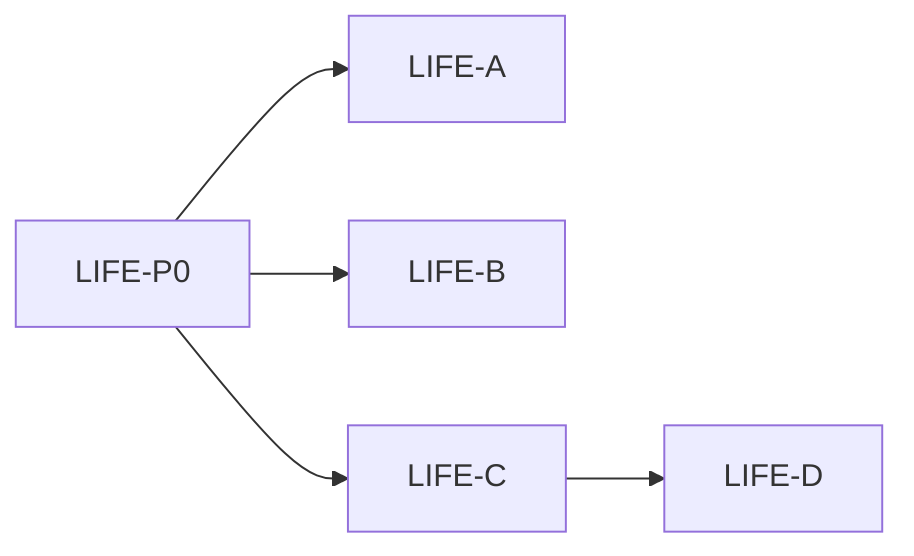

# IDEJE — HOME-14 grupe pitanja

> [[ideje-home-meadow-life|hub]] · freeze [[ideje-home-meadow-life-pitanja|P179–P196]].  
> **Kod šablon:** [[../06-production/plan-prompts-home-meadow-life|plan-prompts-home-meadow-life]].  
> Ne spajati A+D ni C+D. Ne CAMP-02. Ne SEED kod. Ne 8 scena.

## Kako koristiti

1. Plan-agent čita ovu mapu + hub.  
2. Jedan prompt → novi chat → Plan → Agent.  
3. Redoslijed kod: **A ✅ → B ✅ → C ✅ → D ✅**. Docs **LIFE-P0** već ✅.  
4. B neovisno o A. D **čeka C** (safe rect + cvijeće) — C ✅ D ✅.

## Mapa grupa

| Grupa | Pitanja | Prompt | Ovisi o | Korisnik stavka |
|-------|---------|--------|---------|-----------------|
| **Docs** | P190–P192 | **LIFE-P0** ✅ | — | sve |
| **G1 Play** | P179–P183, P193 | **LIFE-A ✅** | P0 | Play 3-koraka |
| **G2 Row** | P184, P194 | **LIFE-B ✅** | P0 | jednaki gumbi |
| **G3 Field** | P185 P186, P195 | **LIFE-C ✅** | P0 | cvijeće + safe |
| **G4 Pip** | P187–P189, P196 | **LIFE-D ✅** | C | hod/njuh/spavanje |

A i B ne čekaju C. D čeka C.

## G1 — Play ✅

Karusel nikad run. Non-playable → snap na `active_season_id`. Playable → open field. Polje → run.

## G2 — PlayRow ✅

Tri jednaka min size. Ne dirati Basket picker/T3.

## G3 — Cvijeće + safe rect ✅

12–14 slotova unutar `meadow_safe_rect()`. Helper koji D ponovo koristi.

## G4 — Pip ✅

MeadowPip on u polju. Walk/Sniff/Sleep FSM. Portrait ostaje off.

## Constraints

| Pravilo |
|---------|
| Ne `frost_field.tscn` / N scena. |
| Ne Shop, AdMob, Unlock JSON, leftover/vacuum rewrite, CAMP-01, CAMP-02, SAVE_VERSION, hub pager. |
| Ne `merge_arena_controller`, run `pip_visual` / `player.gd` / ArenaPip. |
| Ne SeedCatalog JSON. Ne Easy Endless. Ne chevron. |
| Ne vraćati PipPortrait. |

## Povezano

- [[ideje-home-meadow-life|hub]] · [[ideje-home-meadow-chrome|HOME-13]] · [[../06-production/plan-prompts-home-meadow-life|prompti]]
