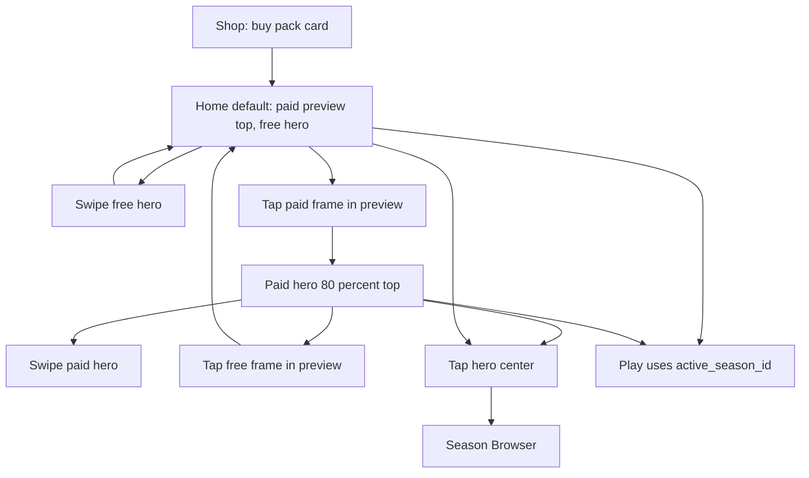

# IDEJE — Paid dual-band + shop packs (HOME-04 hub)

> **ID:** **HOME-04** · v1.1+ (nije v1 launch blocker).  
> **Kod:** **PAID-A–C ✅** (2026-08-20). Prompti: [[../06-production/plan-prompts-home-paid|plan-prompts-home-paid]].  
> **Prethodnik:** [[ideje-home-polish|HOME-01]] P0–C ✅, [[ideje-home-hit-targets|HOME-02]] HIT-A ✅, [[ideje-home-chrome|HOME-03]] CHROME-C ✅, [[ideje-sezone|SEZ-01]] P0–E ✅.  
> **Pillar:** [[../01-vision/design-pillars|Fair F2P]] — paid = tema/kozmetika, **ne** snaga. Gornja traka je **otkriće i odabir**, ne paywall na Play.

## Pitch

Dva problema, jedan track.

**Shop.** Paid sezone su danas **puni shop-gumbi** (visina ~72) s CTA **Select theme / Selected**. Igrač ne treba birati temu u Shopu da bi je igrao — Shop kupuje pack. Odabir živi na Homeu (dual-band) i u Season Browseru. Kartice u Shopu moraju izgledati **kao Browser prozori** (ime + cijena ili Owned), **dvije po redu**, s prostorom za sljedeće redove kad dodamo packove.

**Home.** Free 3-slot traka (HOME-01) radi. Paid su sakriveni (P16) pa igrač bira premium samo kroz Browser/Shop i vidi **mismatch badge** (P21) dok centar i dalje crta zadnju free. Intuicija treba biti:

- Gore **paid**, dolje **free**. Strane se **nikad** ne mijenjaju.
- Default: free je **hero (~80%)** na donjoj strani Stagea; paid je **preview (~20%)** gore, **statičan** dok swipeaš free.
- Tap na **okvir** paid sezone gore → paid raste u hero (80% gore), free se skuplja u preview (20% dolje). Tada paid swipea **isto** kao što free swipea danas.
- Tap na **okvir** free sezone dolje (dok je preview) → natrag na default.
- Klik se prima **samo na okviru sezone**. Praznina = no-op.
- Season Browser **ostaje** (tap centra **hero** trake).

## Zašto sada

SEZ-E Shop/Browser IAP stub radi, ali Shop laže da je **equip** ekran. HOME-03 je očistio chrome i slide. Sljedeći osjećaj: **paid i free su dva svijeta na istom Homeu**, bez miješanja u jedan karusel (to je SEZ-C greška koju je P16 popravio). HOME-04 **ne vraća** paid u isti swipe kao free — daje im **vlastitu traku**.

Kod mora ostati razdvojen: **A Shop**, **B layout traka**, **C gesta/swap** — da agent ne spoji GridContainer s tween visine u jednom krhkom PR-u.

## Freeze ovog chata (2026-08-20)

| # | Odluka |
|---|--------|
| **P45** | Paid traka na Homeu pokazuje **sve** paid sezone. Unowned = sivo + cijena/katanac. Owned = puna boja. Tap unowned u 20% **ipak** prebacuje u paid-fokus; kupnja ostaje Shop / Browser / kartica, ne silent grant. |
| **P46** | **Season Browser ostaje.** Dual-band = brzi odabir. Tap **centra hero (80%)** trake i dalje otvara katalog. Tap centra **preview (20%)** = swap banda, **ne** Browser. |
| **P47–P59** | Freeze **A** / Ne (vidi [[ideje-home-paid-pitanja\|pitanja]]): Shop owned no-op; P12 bez shop band-skoka; persist band; Play nije paywall; katalog order; visina tween u C; Browser horizontal; nema inline IAP / preview swipe / Shop deep-link / reduce-motion / tutorial; Home 3-slot i za N>2. |

Puna tablica: [[ideje-home-paid-pitanja|pitanja]].

## Simptom vs cilj

| Danas | Cilj |
|-------|------|
| Shop: full-width gumb, owned = Select theme | Browser-like kartica; owned = **Owned**, tap no-op |
| Shop: 1 pack po retku u VBox | **2 po redu**, wrap dolje |
| Home: samo free 3-slot; paid nigdje (P16) | Paid **gornja** traka; free **donja**; nisu isti swipe |
| `active` paid + strip free = PlayThemeBadge | Badge ostaje kad vizual hero-centra ≠ playable `active` (P50) |
| Shop `set_active_season` na owned tap | **Uklonjeno.** Active mijenja Home/Browser/grant (P12) |
| Preview swipe ne postoji | Preview je **statičan**; swipe samo na hero 80% |
| Browser i Shop različiti gumbi | Shared pack kartica (PAID-A) |

## Što HOME-04 **jest**

- Shop Season packs vizualni refactor + uklanjanje Select.
- `SeasonStage` **dvije** 3-slot trake: PaidBand top, FreeBand bottom.
- Omjer **20/80** unutar Stagea (uz min visine — vidi layout).
- Click-to-swap: preview frame → ta traka postaje hero.
- Izolirani swipe: hero klizi; druga traka se ne miče.
- Persist `home_band` + `paid_strip_focus_id` (P49 default).
- Fair F2P copy ostaje na Shop hintu.

## Što HOME-04 **nije**

- Nije vraćanje SEZ-C `cycle_playable` (paid i free u **jednom** nizu).
- Nije ukidanje Browsera (P46).
- Nije 2-col grid na Homeu (grid je Shop; Home ostaje 3-slot prozor, P59).
- Nije inline IAP na Home hero u C v1 (P54) — kupnja Shop/Browser.
- Nije follow-finger, wrap, unique S2 seed ID-evi, Play Console, AdMob.
- Nije mijenjanje free unlock math (80 coins / 5 T3, P3–P4).
- Nije brisanje Easy/Normal iz `RunLevelLibrary`.
- Nije D0 launch blocker — v1.1+ kao HOME-01–03.

## Odnos prema starim P

| Staro | HOME-04 |
|-------|---------|
| **P16** paid nikad na Home traci | **Override:** paid su na **zasebnoj gornjoj** traci. **Free traka i dalje samo free.** |
| P19 / **P40** centar = Browser | Ostaje za **hero 80%** centar. Preview centar = **swap**, ne Browser. |
| **P41** gap no-op | Ostaje za **obje** trake. |
| P20 no wrap | Ostaje na **svakoj** traci zasebno. |
| P21 / P43 PlayThemeBadge | Ostaje kad `active` (playable) ≠ hero-centar. |
| P22 3-slot omjer | Isti algoritam na **obje** trake; preview je **minijatura** istog rasporeda. |
| P28 HIT-A IGNORE | Ostaje; djeca obje Row-a IGNORE; Stage STOP. |
| P42 snap-slide | Hero traka; preview ne slidea na swipe. Band-swap = visinski tween (P52). |
| P12 auto-switch na grant | Ostaje za `active_season_id`. Shop owned tap **nije** select. Home band ne skače dok si u Shopu (P48). |
| P6 Browser paid horizontal | Ostaje u ovom tracku (P53). Shop je 2-col; kartica shared. |
| P11 Unlock sheet | Ostaje na locked **free** (hero R ili preview locked). |

## Pojmovnik HOME-04

| Pojam | Značenje |
|-------|----------|
| **PaidBand** | Gornja traka Stagea. Uvijek paid katalog. |
| **FreeBand** | Donja traka Stagea. Uvijek free lanac. |
| **Hero** | Traka na **~80%** visine Stagea. Prima swipe + P40 Browser na centru. |
| **Preview** | Traka na **~20%**. Statična. Tap na okvir sezone → swap. |
| **Band swap** | Hero ↔ preview **visine**; strane (paid top / free bottom) se ne mijenjaju. |
| **`home_band`** | Save: `free` ili `paid` — tko je trenutno hero. |
| **`paid_strip_focus_id`** | Paid analog `strip_focus_id`. |
| **Pack kartica** | Shared widget: izgled Browser prozora (ime + cijena ili Owned). |

## Player loop

1. New game: Country Bloom u free hero centru; gore Mini Moonlit + Coral (unowned, sivo).
2. Swipe free = kao danas. Paid preview se **ne** pomiče.
3. Tap Moonlit okvir gore → Stage se prelomi: Moonlit (i Coral) rastu gore, free se skuplja dolje. Swipe sad mijenja **paid** fokus.
4. Tap Country Bloom (ili drugu free) u donjem previewu → natrag na korak 1.
5. Shop: vidiš iste prozore, 2 u retku. Kupi. Owned. Nema Select. Vrati se Home, biraj na traci / Browseru.

## Što sezona i dalje **ne** mijenja

Isto kao SEZ-01 Fair F2P: merge math, loot %, magnet, fail penalty. Paid pack nije jači run.

## Kod danas (za autora PAID-A/B/C)

| Gdje | Što |
|------|-----|
| [`shop_screen.gd`](../../game/scripts/ui/shop_screen.gd) `_season_pack_button_label` / `_on_season_pack_pressed` | Owned → `set_active_season`. **Obrisati select granu.** |
| [`shop_screen.tscn`](../../game/scenes/ui/shop_screen.tscn) `SeasonPacksList` VBox | Zamijeniti 2-col gridom kartica. |
| [`season_browser.gd`](../../game/scripts/ui/season_browser.gd) `_make_paid_card` | 168×120; owned label "Select" → uskladiti s Owned (shared widget). |
| [`season_stage.gd`](../../game/scripts/ui/season_stage.gd) / [`season_stage.tscn`](../../game/scenes/ui/season_stage.tscn) | **PAID-B+C ✅** PaidBand top / FreeBand bottom; `swap_home_band` tween; izolirani `cycle_paid` / `cycle_free`. |

Katalog: `moonlit_warren`, `coral_tide` u [`seasons.json`](../../game/data/seasons/seasons.json).

## DoD po sliceu (sažetak)

| Slice | Done kad |
|-------|----------|
| **P0** | Ovi docovi + prompti + pointeri. Nema `game/`. |
| **A** | Shop 2-col, izgled kao Browser, owned bez Select; smoke: owned tap ne mijenja active. |
| **B** | Dvije trake vidljive; default free-hero; sve paid kartice; preview ne cyclea. |
| **C** | Tap frame swap; izolirani swipe + slide na hero; Browser samo hero C; smoke proširen. |

## Paket dokumenata

| Doc | Sadržaj |
|-----|---------|
| Ovaj hub | Pitch, scope, override P, loop |
| [[ideje-home-paid-shop\|shop]] | 2-col, bez Select, shared kartica, wrap |
| [[ideje-home-paid-layout\|layout]] | 20/80, min visine, 3-slot paid, nodeovi |
| [[ideje-home-paid-gesta\|gesta]] | Hit mapa, swap, izolacija, HIT-A |
| [[ideje-home-paid-pitanja\|pitanja]] | P45–P59 |
| [[../06-production/plan-prompts-home-paid\|prompti]] | PAID-P0 → A → B → C |

## Agent

- **PAID-C ✅** (track zatvoren). Nema PAID-D (follow-finger, Browser 2-col, inline IAP).
- Kad korisnik dira Shop season packs ili „gdje su paid na Homeu“, predloži **HOME-04**.

## Povezano

- [[ideje-home-polish|HOME-01]] · [[ideje-home-hit-targets|HOME-02]] · [[ideje-home-chrome|HOME-03]]
- [[ideje-sezone|SEZ-01]] · [[ideje-sezone-ekonomija|ekonomija]]
- [[../06-production/CHECKPOINT|CHECKPOINT]]
