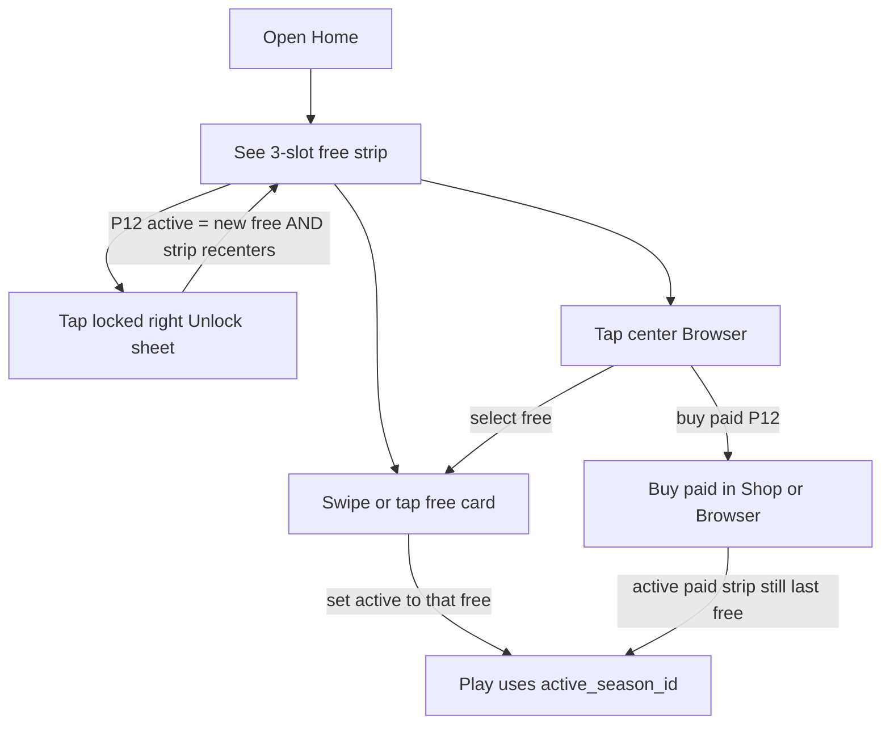

# IDEJE — Home polish (HOME-01 hub)

> **ID:** **HOME-01** · v1.1+ / D0-P kandidat (nije v1 launch blocker).  
> **Kod:** **P0–C ✅** (2026-08-19) — flatten Home, 3-slot strip, Play badge. Prompti: [[../06-production/plan-prompts-home-polish|plan-prompts-home-polish]].  
> **Slijedi:** [[ideje-home-chrome|HOME-03]] CHROME-C ✅. [[ideje-home-hit-targets|HOME-02]] HIT-A ✅. Paid na Homeu: [[ideje-home-paid|HOME-04]] (zasebna gornja traka, ne isti swipe).  
> **Pillar:** [[../01-vision/design-pillars|Fair F2P]] — free traka **ne** prodaje snagu; paid je Shop + HOME-04 PaidBand, ne loot.

## Pitch

Home danas izgleda kao **veliki prozor**: centrirani `Panel` u `main_menu.tscn` drži naslov, tagline, Season Stage karticu i Play. Stage unutra je još jedan „prozor“ — široka ActiveCard s tekstom (ime, tagline, seed peek, rabbit stub) plus uski locked teaser.

Igrač treba **otvoren Home** i **jedno jasno swipe polje na sredini** koje priča priču free sezona:

- U sredini **veći** thumbnail **trenutne free** sezone (new game = Country Bloom).
- Desno **manji** thumbnail **sljedeće** free sezone. Ako je zaključana — siva + katanac. Ako je otključana — puna boja (nije siva).
- Lijevo, kad postoji prethodna otključana free sezona, njen thumbnail **pune boje** da igrač vidi da može swipe natrag.

Kad otključa S2, S2 **prelazi u sredinu**, S1 ide **lijevo** (i ostaje igrivo-izgledajuća, ne siva).

Paid sezone **nisu** slotovi na **free** traci. Kupuju se u Shopu; na Homeu žive u **zasebnoj gornjoj** traci ([[ideje-home-paid|HOME-04]]). HOME-01 P16 je to zabranio u **istom** swipeu — HOME-04 to ne vraća, samo dodaje drugi band.

## Zašto sada

SEZ-01 **P0–E je implementiran** (katalog, unlock, run tema, paid IAP stub). Home Stage iz SEZ-C je **thin slice** da se API vidi — nije finalni Home. Ova ideja **zamjenjuje** taj Stage layout, ne dodaje treći sloj prozora.

## Problem (danas u kodu)

| Što | Gdje | Zašto smeta |
|-----|------|-------------|
| Centrirani Panel ~640×720 | `main_menu.tscn` `Panel` | Izgleda kao plutajući dijalog, ne kao Home |
| ActiveCard stretch 2.3 + min visina 240 | `season_stage.tscn` | Veliki tekstualni prozor umjesto thumbnail karusela |
| `cycle_playable` po **svim** playable | `season_stage.gd` | Paid ulazi u Home swipe; freeze HOME **P16** to zabranjuje |
| Teaser samo next locked | isti | Nakon unlock S2, S1 nestaje s trake umjesto da stoji lijevo |

## Cilj osjećaja

1. Otvoriš hub na Homeu — vidiš meadow, chest/basket gore, **traku sezona u sredini**, Play dolje. Nema kartice-prozora oko svega.
2. Odmah razumiješ: „ovo je moja sezona“ (centar veći) i „ona desno je sljedeća“ (manja, možda katanac).
3. Nakon unlocka sljedeće, stara sezona **ne nestaje u sivilo** — sjeda lijevo kao „mogu se vratiti“.
4. Paid ne zbunjuje linear free priču na Homeu. Premium je Browser/Shop.

## Što HOME-01 **jest**

- Ukinuti Home **chrome Panel**.
- Nova **3-slot free traka** (linear window u `order`).
- Gesta swipe **samo u tom polju**; hub page swipe ostaje izoliran (`block_hub_swipe`).
- P11 ostaje: tap **locked desno** → Unlock sheet, ne Browser.
- Tap **centar** (preporuka P18) → Season Browser (free + paid katalog).
- Play i dalje čita `GameState.active_season_id`.

## Što HOME-01 **nije**

- Nije novi IAP, nije unique S2 seed ID-evi, nije final art pack.
- Nije wrap-around (S3 swipe desno ne skače na S1) — default **P20**.
- Nije paid kartica na Home traci — **P16 freeze**.
- Nije izmjena free unlock math (80 coins / 5 T3, itd.).
- Nije zamjena meta hub SwipePager stranica (Shop · Home · Camp …).

## Odnos prema SEZ-01

| SEZ | Ostaje | Mijenja HOME-01 |
|-----|--------|-----------------|
| B data / save | da | eventualno `strip_focus` polje (vidi carousel doc) |
| C Browser + Unlock sheet | da | Stage vizual + swipe skup |
| D run theme | da | Play i dalje `active_season_id` |
| E Shop paid + Browser paid | da | Home swipe ih **ne** prikazuje |

Stari UX u [[ideje-sezone-ux-home|ideje-sezone-ux-home]] ostaje **povijest SEZ-C**. Za Home layout + swipe čitaj **HOME-01** docove.

## Player loop (Home)

## Paket dokumenata

| Doc | Sadržaj |
|-----|---------|
| Ovaj hub | Pitch, scope, odnos SEZ |
| [[ideje-home-polish-layout\|layout]] | Ubiti Panel; z-order; header/Play/chest |
| [[ideje-home-polish-carousel\|carousel]] | 3 slota, veličine, gest, mismatch paid |
| [[ideje-home-polish-pitanja\|pitanja]] | P16–P27 freeze + otvoreno |
| [[../06-production/plan-prompts-home-polish\|prompti]] | HOME-P0 → A → B → C ✅ |
| [[ideje-home-hit-targets\|HOME-02]] | Hit-through kartica (P28); swipe+tap preko panela |
| [[ideje-home-chrome\|HOME-03]] | Chrome: 2 gumba; Browser samo C; Endless Hard; slide |
| [[ideje-home-paid\|HOME-04]] | Paid dual-band + shop packs (P16 override: zasebna gornja traka) |

## Agent / produkcija

- HOME-01/02/03 kod-trackovi zatvoreni. Paid Shop/Home: **HOME-04** / **PAID-A**.
- Kad Shop season packs ili „gdje su paid na Homeu“: predloži **HOME-04**.

## Povezano

- [[ideje-sezone|SEZ-01]] · [[ideje-sezone-pitanja|SEZ pitanja]] · [[ideje-home-paid|HOME-04]]
- [[../06-production/CHECKPOINT|CHECKPOINT]]
- [[../06-production/scope-i-granice|scope]]
