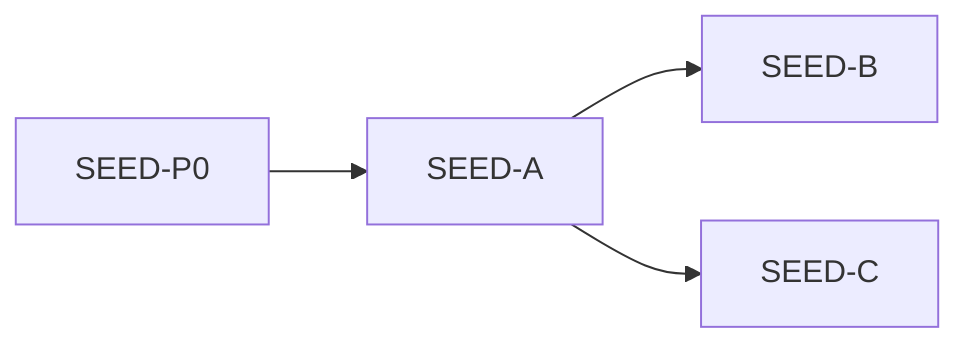

# IDEJE — SEED-01 grupe

> [[ideje-seed-pool|hub]] · freeze [[ideje-seed-pool-pitanja|S1–S16]].  
> Ne spajati A/B/C. Ne MEADOW/CAMP-02 u istom kod chatu.

## Mapa

| Grupa | Pitanja | Prompt | Ovisi |
|-------|---------|--------|-------|
| **Docs** | S15 | **SEED-P0** ✅ | — |
| **G1 Katalog** | S1–S6 S12 S14 | **SEED-A** | P0 |
| **G2 Journal+camp** | S7 S10 | **SEED-B** | A |
| **G3 Draw+pour** | S8 S9 S11 | **SEED-C** | A |
| **G4** | S13 S16 | **nema** | — |

B i C smiju ići **nakon** A, ne nužno B prije C. **MEADOW-B** čeka A.

## G4

SEED ne crta SeasonField. Ne Shop/AdMob/Unlock JSON/leftover vacuum/CAMP-01/SAVE_VERSION/8 scena.

## Povezano

- [[ideje-seed-pool|hub]] · [[../06-production/plan-prompts-seed-pool|prompti]] · [[ideje-home-meadow|HOME-12]]
