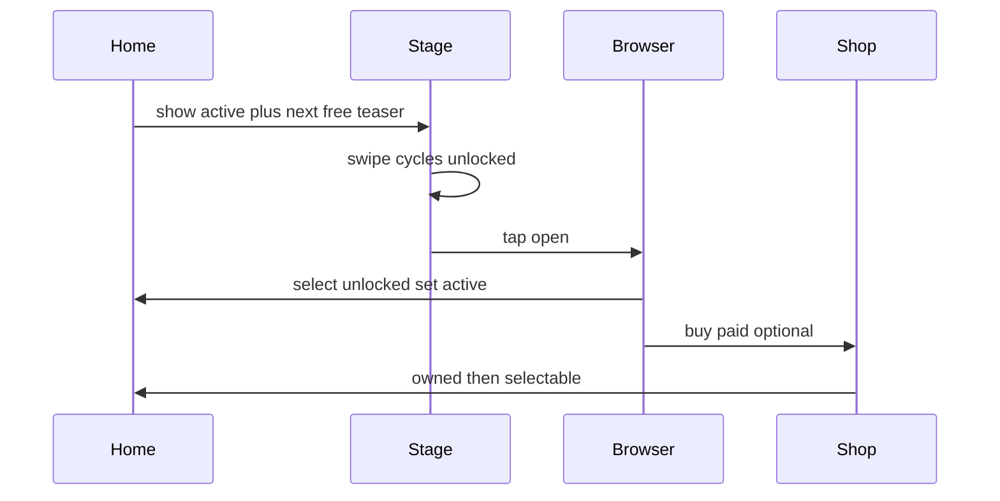

# IDEJE — Sezone UX (Home + Season Browser)

> [[ideje-sezone|SEZ-01]]. **C (Home Stage + Browser free) implementirano.** P11: teaser tap → Unlock sheet samo. Paid Browser red je placeholder (E).

## Cilj osjećaja

Na Homeu igrač **odmah vidi** u kojoj temi živi: veliki vizual, ime sezone, sjeme/cvijet, zec nagrade. Desno „viri“ sljedeća free sezona (zaključana). Swipeom bira što igra; tapom ulazi u katalog free + paid.

## Home — Season Stage

### Layout (središte Home stranice)

```
┌─────────────────────────────────────────────┐
│  [Wallet]                    [Settings]     │
│  DailyChest / Basket (postojeće)            │
├─────────────────────────────────────────────┤
│                                             │
│   ┌──────────────────┐ ┌────────┐           │
│   │  ACTIVE STAGE    │ │ NEXT   │ ← teaser  │
│   │  (pun thumbnail) │ │ FREE   │   locked  │
│   │  Country Bloom   │ │ (sivo) │   partial │
│   │  seeds · flower  │ │ 🔒     │           │
│   │  clear rabbit    │ └────────┘           │
│   └──────────────────┘                      │
│        ← swipe unlocked seasons →           │
│                                             │
│              [ Play ]                       │
└─────────────────────────────────────────────┘
```

### Active Stage (lijevo/centar, dominantan)

| Element | Opis |
|---------|------|
| Background art | Mood sezone (full-bleed u kartici) |
| Title | Display name, npr. **Country Bloom** |
| Seed / flower peek | 2–4 mini ikone iz season poola |
| Clear rabbit | Art „nagrade“ / mascota sezone (vidljiv i prije clear-a, muted ako locked reward) |
| Badge (opc.) | Free / Owned Paid / NEW |
| Progress (opc.) | „3/6 seeds unlocked“ draft |

### Next free teaser (desno, djelomično)

- Samo **sljedeća linearna free** sezona (`order = active_free_order + 1` ili prva locked free).
- **Sivo / desaturirano** + **katanac**.
- Vidi se ~30–40% širine kartice (asocijacija „ima još“).
- Tap → **Unlock sheet** (P11 — ne Browser).

### Swipe na Stageu

| Gesta | Ponašanje |
|-------|-----------|
| Swipe L/R | Ciklus kroz **otključane** sezone (sve free unlocked + sve owned paid) |
| Ne uključuje | Locked free / unowned paid u swipe karuselu Stagea |
| Snap | Uvijek puna kartica (isti pattern kao hub SwipePager — bez mid-page stuck) |
| Play | Koristi `active_season_id` nakon snap-a |

### Odnos prema hub page swipe

- Hub `SwipePager`: Shop ↔ **Home** ↔ Camp ↔ …
- Season Stage swipe je **child** Home pagea — horizontalni drag na Stage zoni **ne** smije ukrasti page change (gesture arena / deadzone — tehnički detalj u data-model / kasniji plan).

## Tap Stage → Season Browser (popup)

Veliki modal / full-ish sheet preko Homea.

```
┌─────────────────────────────────────────────┐
│  Seasons                              [✕]   │
├─────────────────────────────────────────────┤
│  FREE (linear)                              │
│  ┌────┐ ┌────┐ ┌────┐ ┌────┐ → scroll      │
│  │ S1 │ │ S2 │ │🔒S3│ │🔒S4│               │
│  │OK  │ │OK  │ │grey│ │grey│               │
│  └────┘ └────┘ └────┘ └────┘               │
├─────────────────────────────────────────────┤
│  PREMIUM                                    │
│  ┌──────┐ ┌──────┐ ┌──────┐ → scroll       │
│  │Paid A│ │Owned │ │Paid C│                │
│  │ $2.99│ │Select│ │ $3.99│                │
│  └──────┘ └──────┘ └──────┘                │
└─────────────────────────────────────────────┘
```

### Gornji red — Free (linear)

- Horizontalni scroll / strip.
- **Unlocked:** puna boja, tap → `set_active(season)` + zatvori Browser (ili potvrdi).
- **Locked:** sivo + katanac; tap → **Unlock sheet**:
  - „Need **X coins** + **Y T3 flowers**“
  - Progress vs stash (npr. flowers 2/5, coins 40/120)
  - CTA Unlock (disabled dok gate nije ispunjen) / Go to Garden / Play
- Redoslijed = `order` 1…N; ne može se „preskočiti“ free unlock (mora S2 prije S3).

### Donji red — Paid (ne-linear)

**Draft UI (preporuka dok ne odgovoriš):** horizontalni scroll **chips/cards** s:

- Art thumbnail + ime
- Price badge (`$x.xx`) ili **Owned**
- Tap unowned → Shop deep-link **ili** inline IAP sheet
- Tap owned → set active + zatvori

Alternative (zabilježene u [[ideje-sezone-pitanja|pitanja]]): 2-col grid, featured hero + lista.

### Browser → Home sync

Nakon odabira paid ili free unlocked:

1. `active_season_id = chosen`
2. Stage thumbnail refresh
3. Next-free teaser = prva locked free u linear lancu (ne paid)
4. Play koristi novi ID

## Stanja kartice (sažetak)

| Stanje | Stage swipe? | Browser free | Browser paid |
|--------|--------------|--------------|--------------|
| Free unlocked | da | full color | — |
| Free locked | ne | grey+lock | — |
| Paid owned | da | — | Owned / Select |
| Paid unowned | ne | — | Price / Buy |

## Accessibility / čitljivost

- Locked mora biti **očito** (lock + reduced opacity), ne samo blago sivilo.
- Naslov sezone kontrastan na artu (scrim / banner).
- Price pill čitljiv (usklađeno s Garden coin badge stilom).

## Wireflow



## DoD (kad se bude kodiralo — ne sada)

- [ ] Stage pokazuje ime + tema art
- [ ] Next free teaser locked vizual
- [ ] Swipe samo unlocked; snap OK
- [ ] Browser free linear + paid strip
- [ ] Active sync u run
- [ ] Hub page swipe ne lomi se Stage gestom

## Povezano

- [[ideje-sezone|hub]]
- [[ideje-sezone-ekonomija|ekonomija]]
- [[../06-production/ideje-kad-predloziti|UX-04 hub carousel]] (stranice vs Stage)
