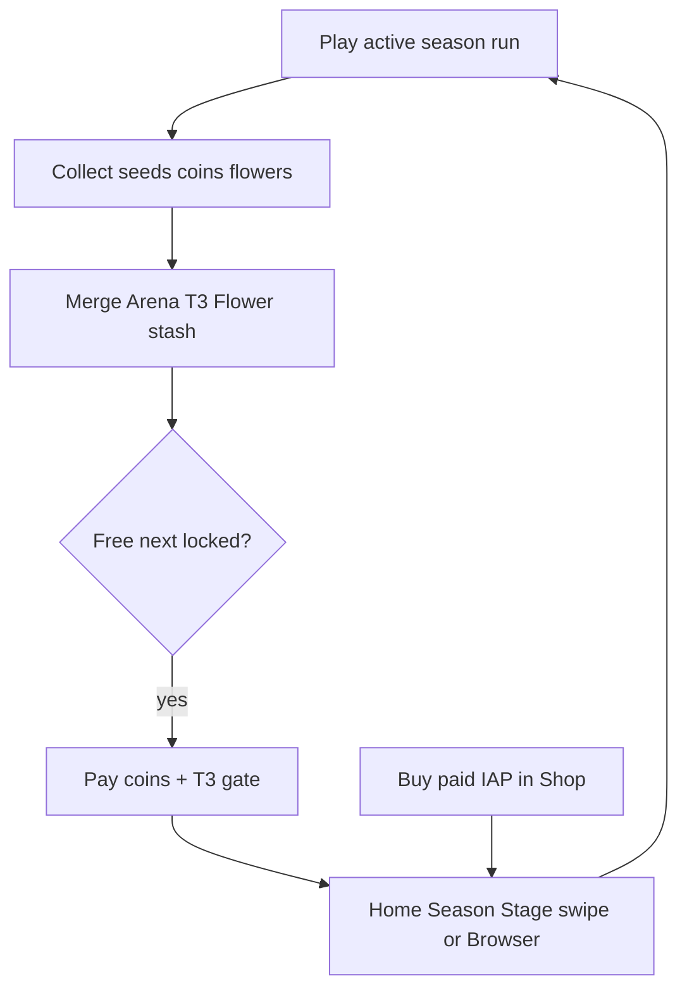

# IDEJE — Sezone / teme (SEZ-01 hub)

> ⚠️ **Design freeze (SEZ-P0).** B (data) ✅; `game/` Home UI od **SEZ-C**.
> **ID:** **SEZ-01** · **v1.1+ IN** (nije v1 launch) — [[../06-production/verzije-nakon-launcha|verzije-nakon-launcha]] · [[../06-production/scope-i-granice|scope]].
> **Pillar:** [[../01-vision/design-pillars|Fair F2P]] — paid = content/kozmetika, ne snaga.

## Pitch

Igrač skuplja **sjeme**, **T3 cvjetove (Flower)** i **novčiće** da otključava **sezone** — tematske svjetove s vlastitim sjemenima, run pozadinom, životinjom, neprijateljima i Home thumbnailom.

- **Free sezone** idu **linearno** (S1 → S2 → …): prva je besplatna; sljedeće koštaju soft coins **i** zahtijevaju prag T3 flowera.
- **Paid sezone** kupuju se **pravim novcem** u Shopu (IAP), nisu linearne, imaju ekskluzivni dizajn.
- Na **Home** je uvijek **aktivna sezona**; swipe L/R bira među otključanim; tap otvara **Season Browser** (free gore, paid dolje).

**Zašto:** retention (novi vizualni svjetovi), jasna soft-sink petlja (coins + flowers), Fair IAP (tema, ne pay-to-win).

## Scope

| | |
|--|--|
| **v1 launch** | ❌ OUT |
| **v1.1+** | ✅ **IN (P0)** |
| **Trenutni track** | **P0–E ✅** — natrag na D0-P / playtest |

## Pojmovnik

| Pojam | Značenje |
|-------|----------|
| **Season** | Tematski paket: seed pool, art, animal, enemies, Home card |
| **Free season** | Soft unlock; redoslijed fiksan (`order`) |
| **Paid season** | IAP; neovisan od free lanca (draft — vidi pitanja) |
| **Active season** | `active_season_id` — Home Stage + run koriste isti ID |
| **Unlock gate** | Free S2+: `coins_cost` + `t3_flowers_required` |
| **Season catalog** | Lista `SeasonDef` (data) |
| **Season Stage** | Središnji Home vizual aktivne (+ teaser sljedeće free) |
| **Season Browser** | Full popup: free lane gore, paid dolje |
| **Clear rabbit** | Vizual/nagrada vezana uz „pređenu“ sezonu (kozmetika draft) |

## Player loop

1. Igrač igra **Country Bloom** (S1) — odmah otključano.
2. Kroz runove i merge skuplja sjeme te sezone, coins, T3 flowere.
3. Otključa S2 free (coins + T3 prag) **ili** kupi paid pack u Shopu.
4. Na Homeu swipe/Browser bira aktivnu sezonu → Play koristi tu temu.

## Default S1 — Country Bloom

| Polje | Draft |
|-------|--------|
| `id` | `country_bloom` |
| Kind | free |
| `order` | 1 |
| Unlock | odmah (`unlocked` na new game) |
| Mood | topla livada, seoski pasteli, jutarnje svjetlo |
| Seed draft | 6 tipova: **3× ★1, 2× ★2, 1× ★3** (brojevi nisu finalni) |
| Animal | Pip (default) + „clear“ country rabbit art brief |
| Run | postojeći lane feel + country BG / obstacle reskin kasnije |

Primjer seed slotova (placeholder imena — vidi [[ideje-sezone-content|content]]):

| Slot | Rarity | Placeholder name |
|------|--------|------------------|
| 1–3 | ★1 | Meadow Clover, Daisy Path, Buttercup Lane |
| 4–5 | ★2 | Barn Tulip, Sunfence |
| 6 | ★3 | Harvest Pumpkin |

> **Pitanje:** nova imena/ID-evi ili remap postojećih 7 tipova (clover…watermelon)? → [[ideje-sezone-pitanja|pitanja]]

## Što sezona **mijenja** (cilj)

| Sloj | Efekat |
|------|--------|
| Seed / spawn pool | Samo tipovi te sezone (ili subset) u runu + Almanac/unlock unutar sezone |
| Run background | Tema (livada, snijeg, noćni festival…) |
| Animal / companion | Skin ili unlock rabbit uz clear |
| Enemies / obstacles | Vizualni reskin (ista gameplay kolizija draft) |
| Home thumbnail | Ime, mood art, seed/flower peek, clear rabbit |
| Shop | Paid pack rows |
| Journal | Filter po sezoni **TBD** |

## Što sezona **ne** mijenja (v1.1 draft — Fair F2P)

- Merge matematiku (2→1, T1–T3)
- Soft wallet pravila osim **troška unlocka** free sezone
- Magnet / loot multiplier snagu vezanu uz paid
- Paywall na Play za S1
- Obavezni IAP za napredak free lanca (grind path mora postojati)

## Detaljni docovi (paket)

| Doc | Sadržaj |
|-----|---------|
| [[ideje-sezone-ux-home\|UX Home + Browser]] | Stage, swipe, popup free/paid |
| [[ideje-sezone-ekonomija\|Ekonomija]] | Coins, T3 gate, IAP, Pillar 2 |
| [[ideje-sezone-content\|Content bible]] | S1 + placeholder free/paid |
| [[ideje-sezone-data-model\|Data model]] | SeasonDef, save, build order A–E |
| [[ideje-sezone-pitanja|Otvorena pitanja]] | Freeze P1–P15; P11 = Unlock sheet samo |
| [[../06-production/plan-prompts-sez-01\|Plan promptovi]] | Copy-paste **P0 → B → C → D → E** |

## Odnos prema hub carouselu

Meta hub već ima swipe **stranica** (Shop · Home · Camp · …). Season Stage je **unutrašnji** kontroler **na Home stranici** — ne mijenja page index hub pagera. Vidi [[ideje-sezone-ux-home|UX]].

## Agent / produkcija

- Predloži **SEZ-01** kad se radi Home polish, Shop IAP, ili post-launch retention.
- **Implementacija:** zalijepi prompt iz [[../06-production/plan-prompts-sez-01|plan-prompts-sez-01]] (sljedeće **SEZ-B**).
- Format predlaganja: vidi [[../06-production/ideje-kad-predloziti|ideje-kad-predloziti]].

## Povezano

- [[../01-vision/design-pillars|design-pillars]]
- [[../02-design/ekonomija|ekonomija]] · [[../02-design/ekonomija-brojevi|ekonomija-brojevi]]
- [[ideje-gameplay-ekonomija|ideje-gameplay-ekonomija]]
- [[../06-production/scope-i-granice|scope-i-granice]] · [[../06-production/verzije-nakon-launcha|verzije-nakon-launcha]]
