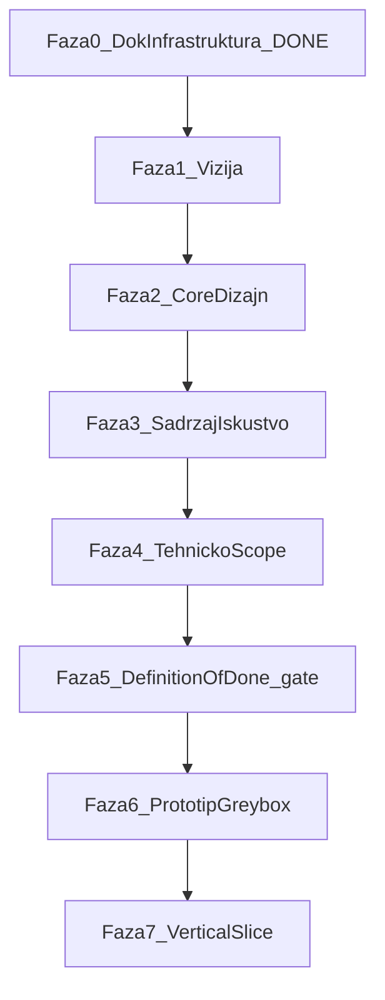

# Radionica razvoja — do vertical slice-a

> **Jedini izvor istine** za redoslijed rada od dokumentacije do prvog igrivog vertical slice-a.
> Beta, launch i marketing nisu u ovom dokumentu.

**Trenutna faza:** `trenutna_faza: 5` · `podfaza: greybox-spreman` (CHECKPOINT vodi M6)

Sažeti pregledi: [[milestone-i|milestone-i]] · [[roadmap|roadmap]]

---

## Faza 0 — Infrastruktura ✅

### Cilj

Dokumentacijski sustav postoji i može se popunjavati fazu po fazu.

### Preduvjeti

Nema — početno stanje projekta.

### Koraci

1. Kreirana folder struktura (`docs/` — 7 slojeva)
2. Hub stranice (`_index.md`) za svaki sloj
3. Seed dokumenti s predlošcima (pitch, core-loop, engine-odluka, …)
4. [[../07-meta/otvorena-pitanja|otvorena-pitanja]] — parking lot za neriješeno

### Pitanja za tebe

_(nema — faza gotova)_

### Deliverables

- [x] Folder struktura i hub stranice
- [x] Predlošci za sve ključne dokumente
- [x] [[../00-home|00-home]] — Definition of Done checklist
- [x] Ovaj master dokument

### Exit kriterij

**Gotovo kad** agent i korisnik mogu otvoriti bilo koji seed dokument i znati što treba popuniti.

### Sljedeća faza

→ [[#Faza 1 — Vizija|Faza 1 — Vizija]]

---

## Faza 1 — Vizija

### Cilj

Nakon ove faze možeš u jednoj rečenici reći što gradimo, za koga i zašto je to zanimljivo.

### Preduvjeti

- [[#Faza 0 — Infrastruktura ✅|Faza 0]] završena

### Koraci

Detaljni koraci u [[../01-vision/RADIONICA-faza-1|RADIONICA-faza-1]] — popuni redom:

1. **Pitch** → [[../01-vision/pitch|pitch]] — radni naziv, jedna rečenica, paragraf, keywords
2. **Koncept** → [[../01-vision/koncept|koncept]] — emocija, mobilna platforma, player promise
3. **Publika** → [[../01-vision/ciljana-publika|ciljana-publika]] — dob, session length, navike
4. **Pillars** → [[../01-vision/design-pillars|design-pillars]] — 3 principa s primjerima
5. **Konkurencija** → [[../01-vision/konkurencija-i-inspiracija|konkurencija-i-inspiracija]] — 3 reference, diferencijacija

### Pitanja za tebe

Agent postavlja ova pitanja u chatu **prije** pisanja u dokumente:

1. Koji je **radni naziv** igre? (može se promijeniti kasnije)
2. Koji je **primarni žanr**? (npr. arcade puzzle, roguelite runner, idle strategy)
3. Što igrač radi u **jednoj rečenici**? (akcija + hook)
4. Zašto bi netko preuzeo igru nakon **10 sekundi** gledanja store listinga?
5. Koja je **primarna emocija** koju igrač treba osjetiti?
6. Tko je **primarni igrač** — dob, iskustvo s igrama, koliko dugo igra po sesiji?
7. Koja su **3 design pillara** koja ne smijemo prekršiti?
8. Koje su **3 referentne igre** — što uzimamo, što izbjegavamo?

_(Vidi i [[../07-meta/otvorena-pitanja|otvorena-pitanja]] — sekcija Vizija)_

### Deliverables

- [x] [[../01-vision/pitch|pitch]] — jedna rečenica + paragraf + keywords
- [x] [[../01-vision/koncept|koncept]] — fantasy + jedinstvenost
- [x] [[../01-vision/ciljana-publika|ciljana-publika]] — primarna publika definirana
- [x] [[../01-vision/design-pillars|design-pillars]] — min. 3 pillara
- [x] [[../01-vision/konkurencija-i-inspiracija|konkurencija-i-inspiracija]] — 3 reference

### Exit kriterij

**Gotovo kad** svih 5 deliverablea ima konkretan sadržaj (nema `_TBD_` ili `_[...]_` u ključnim poljima).

### Sljedeća faza

→ [[#Faza 2 — Core dizajn|Faza 2 — Core dizajn]]

---

## Faza 2 — Core dizajn

### Cilj

Jasno definiran core loop i 3 glavne mehanike — igrač zna što radi svakih 30 sekundi.

### Preduvjeti

- [[#Faza 1 — Vizija|Faza 1]] završena (pillars služe kao filter za dizajn odluke)

### Koraci

1. Nacrtaj **30s petlju** → [[../02-design/core-loop|core-loop]]
2. Definiraj **3 glavne mehanike** → [[../02-design/mehanike/_index|mehanike/_index]] (po jedan fajl po mehanici)
3. Opis **progresije** (što se otključava, kako raste težina) → [[../02-design/progresija|progresija]]
4. Definiraj **kontrole i input** (touch, gesture, UI) → [[../02-design/kontrole-i-input|kontrole-i-input]]

### Pitanja za tebe

1. Kako izgleda **30-sekundna petlja**? (akcija → feedback → nagrada)
2. Koje su **3 must-have mehanike** za v1?
3. Koliko traje tipična **sesija** (min) i što je satisfying stop?
4. Kako igrač **napreduje** između sesija (ili je sve u jednoj)?
5. Koje su **kontrole** — tap, swipe, drag, virtual joystick?
6. **Premium ili F2P** — utječe na loop i progresiju?
7. Što je **fail state** i kako izgleda retry?
8. Koja mehanika je **prva** za prototip (Faza 6)?

### Deliverables

- [x] [[../02-design/core-loop|core-loop]] — 30s i 5min petlja opisane
- [x] [[../02-design/mehanike/_index|mehanike]] — 3 mehanike dokumentirane
- [x] [[../02-design/progresija|progresija]] — kako raste igrač/svijet
- [x] [[../02-design/kontrole-i-input|kontrole-i-input]] — input mapa za mobilni

### Exit kriterij

**Gotovo kad** netko može nacrtati core loop na papiru samo iz dokumentacije.

### Sljedeća faza

→ [[#Faza 3 — Sadržaj i iskustvo|Faza 3 — Sadržaj i iskustvo]]

---

## Faza 3 — Sadržaj i iskustvo

### Cilj

Svijet, vizualni identitet i UI flow su dovoljno jasni da se može skicirati ekran po ekran.

### Preduvjeti

- [[#Faza 2 — Core dizajn|Faza 2]] završena

### Koraci

1. Opis **svijeta i lore-a** (koliko treba za slice) → [[../03-content/svijet-i-lore|svijet-i-lore]]
2. Definiraj **UI/UX flow** (menu → igra → rezultat → retry) → [[../04-experience/ui-ux|ui-ux]]
3. Odaberi **art direction** (stil, paleta, referentne slike) → [[../04-experience/art-direction|art-direction]]

### Pitanja za tebe

1. Koji je **vizualni stil**? (pixel art, flat, low-poly 3D, hand-drawn…)
2. Koliko **nivoa** treba za vertical slice — 1 ili više?
3. Kakav je **UI flow** od otvaranja app-a do prvog gameplaya?
4. Treba li **priča/lore** u slice-u ili je čisti gameplay?
5. Koja je **paleta boja** i mood (vedro, mračno, neon…)?
6. Kako izgleda **game over / win** ekran?
7. Treba li **audio** u slice-u (SFX, muzika) ili samo placeholder?
8. Koji je **prvi ekran** koji igrač vidi — splash, menu, direktno u igru?

### Deliverables

- [x] [[../03-content/svijet-i-lore|svijet-i-lore]] — dovoljno za 1 nivo
- [x] [[../04-experience/ui-ux|ui-ux]] — wireflow menu → igra → retry
- [x] [[../04-experience/art-direction|art-direction]] — stil + reference

### Exit kriterij

**Gotovo kad** možeš opisati svaki ekran u slice-u redom, bez pitanja “što dalje?”.

### Sljedeća faza

→ [[#Faza 4 — Tehničko i scope|Faza 4 — Tehničko i scope]]

---

## Faza 4 — Tehničko i scope

### Cilj

Engine, platforme i IN/OUT lista za v1 su odlučeni — nema “možda kasnije” u kritičnim stavkama.

### Preduvjeti

- [[#Faza 3 — Sadržaj i iskustvo|Faza 3]] završena

### Koraci

1. Usporedi i odaberi **engine** → [[../05-technical/engine-odluka|engine-odluka]]
2. Definiraj **platforme** (Android-first, iOS, oba) → [[../05-technical/platforme|platforme]]
3. Napiši **IN/OUT listu** za v1 vertical slice → [[scope-i-granice|scope-i-granice]]
4. Procijeni **kapacitet** — sati tjedno, solo/tim (za roadmap, bez datuma)

### Pitanja za tebe

1. **Godot vs Unity** vs drugo — što već znaš, što preferiraš?
2. **Android-first** ili oba store-a od starta?
3. Što je **IN** za v1 vertical slice? (lista feature-a)
4. Što je eksplicitno **OUT** (ne radimo u slice-u)?
5. **2D ili 3D** — i zašto?
6. Koliko **sati tjedno** možeš posvetiti projektu?
7. **Solo dev** ili imaš suradnike (art, audio)?
8. Treba li **online** (leaderboard, cloud save) u slice-u?

### Deliverables

- [x] [[../05-technical/engine-odluka|engine-odluka]] — izbor + obrazloženje
- [x] [[../05-technical/platforme|platforme]] — target platforme
- [x] [[scope-i-granice|scope-i-granice]] — IN/OUT lista za v1
- [x] Kapacitet zabilježen u [[roadmap|roadmap]] (sati/tjedno, TBD datumi)

### Exit kriterij

**Gotovo kad** možeš krenuti u `game/` folder bez dvojbe o engine-u i scope-u.

### Sljedeća faza

→ [[#Faza 5 — Gate prije koda|Faza 5 — Gate prije koda]]

---

## Faza 5 — Gate prije koda

### Cilj

Svi dokumenti iz Definition of Done su popunjeni — nema koda dok gate ne prođe.

### Preduvjeti

- [[#Faza 4 — Tehničko i scope|Faza 4]] završena

### Koraci

1. Prođi **Definition of Done** checklist na [[../00-home|00-home]] — svih 7 stavki
2. Za svaku neispunjenu stavku: identificiraj fazu i **vrati se** na odgovarajući dokument
3. Ažuriraj [[milestone-i|milestone-i]] — M1 kriteriji usklađeni s odlukama iz Faza 1–4
4. Zabilježi gate prolaz u [[../07-meta/changelog|changelog]]

### Pitanja za tebe

1. Možeš li u **jednoj rečenici** reći što je igra? (provjera pitch-a)
2. Možeš li opisati **core loop u 30s** bez gledanja u notes?
3. Jesu li **3 mehanike** jasno razdvojene (nema preklapanja)?
4. Je li **IN/OUT** lista realna za tvoj kapacitet?
5. Jesi li **spreman** prestati dodavati feature-e i krenuti u kod?

### Deliverables

- [x] [[../00-home|00-home]] DoD — svih 7 checkboxova ✅
- [x] [[milestone-i|milestone-i]] — M7 kriteriji usklađeni; M5 gate prolaz
- [x] Nema kritičnih otvorenih pitanja u [[../07-meta/otvorena-pitanja|otvorena-pitanja]] za faze 1–4

### Exit kriterij

**Gotovo kad** svih 7 DoD stavki na home stranici može biti označeno `[x]`.

### Sljedeća faza

→ [[#Faza 6 — Prototip (greybox)|Faza 6 — Prototip (greybox)]]

---

## Faza 6 — Prototip (greybox)

### Cilj

Prvi igrivi build — jedna mehanika, placeholder grafika, dokaz da loop “osjeća” dobro.

### Preduvjeti

- [[#Faza 5 — Gate prije koda|Faza 5]] prošla
- `game/` folder kreiran s odabranim engine-om

### Koraci

1. Inicijaliziraj **`game/`** projekt (engine iz [[../05-technical/engine-odluka|engine-odluka]])
2. Implementiraj **1 mehaniku** (onu označenu u Fazi 2 kao prvu)
3. Placeholder **grafika** (geometrijske forme, besplatni asseti)
4. Osnovni **input** prema [[../02-design/kontrole-i-input|kontrole-i-input]]
5. **Playtest** — 5 minuta, bilješke što “ne štima”

### Pitanja za tebe

1. Je li **feel** mehanike blizu onome što si zamislio?
2. Što je **najsporiji** dio loop-a — treba skratiti?
3. Radi li na **target uređaju** (ili emulatoru)?
4. Treba li **kamera/UI** prije druge mehanike?
5. Koje **3 stvari** mijenjaš prije Faze 7?

### Deliverables

- [ ] `game/` folder s build-abilnim projektom
- [ ] 1 mehanika igriva od start do fail/reward
- [ ] Placeholder art — nije blokirajuće za test
- [ ] Kratke bilješke playtesta (u [[../07-meta/changelog|changelog]] ili zasebno)

### Exit kriterij

**Gotovo kad** možeš poslati APK/build prijatelju i dobiti smislen feedback na feel, ne na grafiku.

### Sljedeća faza

→ [[#Faza 7 — Vertical slice|Faza 7 — Vertical slice]]

---

## Faza 7 — Vertical slice

### Cilj

Jedan kompletan, poliran isječak igre: menu → igra → rezultat → retry — spreman za vanjski feedback.

### Preduvjeti

- [[#Faza 6 — Prototip (greybox)|Faza 6]] završena
- Greybox mehanika validirana playtestom

### Koraci

1. **1 nivo** s punim contentom (prema [[scope-i-granice|scope-i-granice]] IN listi)
2. **Menu flow** — splash → main → igra (prema [[../04-experience/ui-ux|ui-ux]])
3. **Art pass** na slice — prema [[../04-experience/art-direction|art-direction]]
4. **SFX** (minimalno) — ako je u scope-u
5. **Win/lose + retry** — zatvorena petlja
6. Ažuriraj [[milestone-i|milestone-i]] M1 kao ✅

### Pitanja za tebe

1. Je li **menu → igra → retry** flow intuitivan bez objašnjenja?
2. Izgleda li slice kao **prava igra**, ne demo?
3. Što bi **igrač pitao** nakon 5 minuta — imamo li odgovor u dizajnu?
4. Koji je **sljedeći korak** nakon slice-a (alpha, više nivoa, marketing)?
5. Tko je **prvi vanjski playtester**?

### Deliverables

- [ ] 1 nivo — kompletan od početka do kraja
- [ ] Menu → igra → rezultat → retry
- [ ] Art i UI na razini “pokazivo investitoru/prijatelju”
- [ ] [[milestone-i|milestone-i]] M1 — svi kriteriji ispunjeni

### Exit kriterij

**Gotovo kad** netko tko nije radio na projektu može igrati 5+ minuta bez tvog vođenja i razumjeti što je igra.

### Sljedeća faza

_(izvan ovog dokumenta — alpha, beta, launch)_

---

## Kako radimo sesije

Tri pravila za korisnika i agenta:

1. **Agent čita `trenutna_faza`** iz frontmattera ovog dokumenta na početku sesije.
2. **Agent postavlja 2–4 pitanja** iz sekcije “Pitanja za tebe” trenutne faze **prije** pisanja u druge `.md` fajlove.
3. **Odgovori se zapisuju** u ciljne dokumente; riješena pitanja premještaju se u [[../07-meta/otvorena-pitanja|otvorena-pitanja]] → sekcija “Riješeno ✅”. Kad faza završi, ažuriraj `trenutna_faza` u frontmatteru.

## Povezano

- [[../01-vision/RADIONICA-faza-1|RADIONICA-faza-1]] — detaljni koraci Faze 1
- [[milestone-i|milestone-i]] — sažeti milestone-i M0–M7
- [[roadmap|roadmap]] — pregled faza
- [[../00-home|Home]]
- [[../07-meta/otvorena-pitanja|otvorena-pitanja]]
