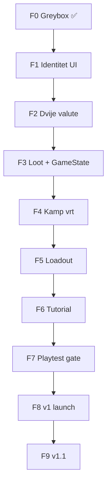

# IDEJE — roadmap implementacije (build order)

> ⚠️ **Scratch plan rada.** Ne mijenja `CHECKPOINT` checkboxove ni kanon docove dok korisnik ne kaže "promoviraj".
> **Cilj:** solo dev zna **što kodirati sljedeće** da stigne do [[../03-content/ideje-prvo-iskustvo|prvog iskustva (5 min)]], pa do v1 launcha.
> **Pravilo sesije:** jedan korak (ili mala grupa) po sesiji → headless smoke → 5 min playtest.

## Gdje smo sada (baseline — 2026-07-04)

| Komponenta | Stanje | Fajlovi |
|------------|--------|---------|
| Loop main→run→loot→kamp | ✅ radi | `game_state.gd`, scene flow |
| Lane run 3+swipe+tween | ✅ | `run_controller.gd`, `player.gd` |
| Generički "orb" + prepreka | ✅ greybox | `orb.gd`, `obstacle.gd` |
| Loot ×2 / revive / retry | ✅ revive = nastavi run | `loot_screen.gd` |
| Kamp 9-slot grid + merge T1→T2 | ✅ → **F4 vrt 6 gredica** | `camp_bed.gd`, `camp_controller.gd` |
| Magnet upgrade + efekt u runu | ✅ | `game_state.gd`, `player.gd` |
| Pip identitet | ✅ placeholder | `pip_draw.gd`, main menu |
| Novčići vs sjeme | ✅ coins + Clover seed | `coin.gd`, `seed_pickup.gd` |
| Loot po tipu sjemena | ✅ | `last_seed_bag`, `format_loot_label()` |
| Vrt / staklenik / loadout | ✅ loadout 1 slot | `loadout_type_id`, camp basket |
| Tutorial po novom scenariju | ✅ F6 | `tutorial_step`, run1/2 |

---

## Faze — pregled

```
[F0] Greybox loop          ✅ GOTOWO (M6 + M7 C1)
[F1] Identitet u UI        → Pip placeholder + tagline
[F2] Dvije valute u runu   → novčići + sjeme (Clover)
[F3] Loot + GameState      ✅ inventar po tipu, deponiranje
[F4] Kamp vrt (K1)         ✅ gredice, bag, merge, staklenik locked
[F5] Loadout (K6)          ✅ 1 slot, +5% spawn
[F6] Tutorial skripta      ✅ Run1/2 vođenje, loadout nakon mergea
[F7] Prvo iskustvo DONE   → playtest DoD iz ideje-prvo-iskustvo
─────────── v1 launch ───────────
[F8] Sadržaj + polish      → 10 sjemena, staklenik, shop, ads
[F9] v1.1                  → grmovi, dnevnik, ostatak
```

---

## F0 — Greybox (završeno)

- [x] B1–B3 lane run
- [x] C1 loop + revive fix
- [x] `spec-vertical-slice` + `ekonomija-brojevi` (kanon za *trenutni* kod)

**Ne vraćati se** osim bugfixa.

---

## F1 — Identitet u kodu (bez novih mehanika)

**Cilj:** igrač vidi *Pip-a* i jednu rečenicu prije runa.  
**Mapa:** [[../03-content/ideje-prvo-iskustvo#0000015--main-menu|0:00–0:15 Main menu]]  
**Effort:** S (1 sesija)  
**Status:** ✅ 2026-07-04

| # | Zadatak | DoD |
|---|---------|-----|
| F1.1 | Pip **placeholder sprite** (ColorRect → Sprite2D ili jednostavan SVG) u `player.tscn` | Nije kvadratić; isti hitbox |
| F1.2 | Main menu: tagline *"Help Pip bring color back to the meadow."* | Tekst ispod Play |
| F1.3 | Run HUD: ime "Pip" ili mali portrait (opcionalno) | — |

**Implementirano:** `PipDraw` + `pip_placeholder_control.gd`; player `_draw()`; main menu Pip + tagline; run HUD `PipBadge`.

**Ne dirati:** spawn, ekonomiju, kamp layout.

**Fajlovi:** `player.tscn`, `main_menu.tscn`, `main_menu.gd`

---

## F2 — Dvije valute u runu

**Cilj:** novčići često, sjeme rijetko (prvo samo **Clover ★**).  
**Mapa:** [[../03-content/ideje-prvo-iskustvo#0150130--run-1--novčići-i-prvo-sjeme|Run 1]]  
**Effort:** M (1–2 sesije)  
**Ovisi o:** F1 (vizual opcionalno)  
**Status:** ✅ 2026-07-04 — `coin` + `seed_pickup`, HUD Coins/Seeds, loot oboje, `wallet_coins`

| # | Zadatak | DoD |
|---|---------|-----|
| F2.1 | Novi pickup: `coin.tscn` + `coin.gd` (grupa `coin`) | SKUPLJANJE → `coin_count` |
| F2.2 | Refaktor `orb` → `seed_pickup` ili proširiti `orb.gd` s `type_id` + `rarity` | Clover ★ spawn |
| F2.3 | `run_controller`: odvojeni brojači `coin_count`, `seed_inventory` (dict ili array) | HUD: Coins + Seeds |
| F2.4 | Spawn logika: novčići ~70% pickupa, sjeme ~30%, prepreka odvojeno | Run 1 feel test |
| F2.5 | Različit juice: coin = mali pop, seed = veći fanfare | — |

**Fajlovi:** `run_controller.gd`, novi `coin.gd`, `orb.gd` ili `seed_pickup.gd`, scene

**Ne dirati još:** kamp prima sjemena (F3).

---

## F3 — Loot i GameState inventar

**Cilj:** kraj runa prenosi novčiće + sjemena u `GameState`; fail = 50% **sjemena i novčića**.  
**Effort:** M (1 sesija)  
**Ovisi o:** F2  
**Status:** ✅ 2026-07-04

| # | Zadatak | DoD |
|---|---------|-----|
| F3.1 | `GameState`: `wallet_coins`, `seed_bag: Dictionary` (type_id → count) | Perzistentno u sesiji |
| F3.2 | `finish_run()` prima coins + seeds, ne jedan `orb_count` | Backward compat migrirati |
| F3.3 | Loot ekran: prikaži "+X Coins", "+Y Seeds (Clover)" | Razdvojeni redovi |
| F3.4 | Fail pravilo: `round(seeds * 0.5)`, novčići 50% | Scratch + kod usklađeni |
| F3.5 | `deposit_loot_to_camp()` → deponira **sjeme** u kamp (ne apstraktni `last_loot` int) | — |

**Implementirano:** `last_seed_bag`, `carry_seed_bag`, `format_loot_label()`, `sum_seed_bag()`; revive nosi bag; deposit u camp slotove.

**Fajlovi:** `game_state.gd`, `loot_screen.gd`, `run_controller.gd`

---

## F4 — Kamp vrt (K1) — zamjena grida

**Cilj:** gredice, sadnja sjemena iz `seed_bag`, merge 2× isti tip → T2 cvijet.  
**Mapa:** [[../03-content/ideje-prvo-iskustvo#1300245--kamp--prva-gredica|Kamp 1]], [[../03-content/ideje-prvo-iskustvo#3450445--kamp--prvi-merge|Kamp 2 merge]]  
**Effort:** L (2–3 sesije)  
**Ovisi o:** F3  
**Status:** ✅ 2026-07-04

| # | Zadatak | DoD |
|---|---------|-----|
| F4.1 | Nova scena ili refactor `camp_scene`: **6 gredica** (v1 launch target) | Vizual gredica, ne grid gumbi |
| F4.2 | Tap prazna gredica + izbor sjemena iz baga → T1 planted | `clover` T1 sprite |
| F4.3 | Merge: tap dva ista `type_id` T1 → jedan T2 cvijet | Isti tip, različit tip = ne |
| F4.4 | `info_label` tekstovi iz ideje-prvo-iskustvo | Plant / merge poruke |
| F4.5 | Staklenik u pozadini **zaključan** (sprite + lock) | Bez gameplaya još |
| F4.6 | Magnet → preimenovati u **prskalica** (UI tekst + ikona) | Stari `try_upgrade_magnet` može ostati privremeno |

**Migracija:** `camp_slots` → `garden_beds[]` s `{ type_id, tier }`; loot ide u `seed_bag`.

**Implementirano:** 6 gredica (`CampBed`), `camp_plant_draw`, staklenik locked, sprinkler UI, plant/merge flow.

**Fajlovi:** `camp_controller.gd`, `camp_scene.tscn`, `game_state.gd`, `camp_bed.gd`, `camp_plant_draw.gd`

---

## F5 — Loadout (K6) — 1 slot

**Cilj:** prije runa staviš Clover u koš → +5% spawn šanse u runu.  
**Mapa:** [[../03-content/ideje-prvo-iskustvo#420--loadout-otključan|Loadout unlock]]  
**Effort:** M (1 sesija)  
**Ovisi o:** F4 (kamp UI postoji)  
**Status:** ✅ 2026-07-04

| # | Zadatak | DoD |
|---|---------|-----|
| F5.1 | `GameState.loadout_type_id` + `LOADOUT_SPAWN_BONUS` | ✅ |
| F5.2 | Kamp UI: basket tap toggle equip/clear | ✅ `LoadoutButton` |
| F5.3 | `run_controller`: +5% seed spawn + loadout type | ✅ |
| F5.4 | Run HUD: `Basket: Clover` kod Pip badge | ✅ |

**Debug:** `DEBUG_DEV_RESOURCES` — 20 coins + 20 Clover na boot / ulaz u kamp (bez savea).

**Fajlovi:** `camp_controller.gd`, `game_state.gd`, `run_controller.gd`, `camp_scene.tscn`, `run_scene.tscn`

---

## F6 — Tutorial skripta

**Cilj:** automatizirati [[../03-content/ideje-prvo-iskustvo|5-min scenarij]] bez ručnog QA svaki put.  
**Effort:** M (1–2 sesije)  
**Ovisi o:** F2–F5  
**Status:** ✅ 2026-07-04

| # | Zadatak | DoD |
|---|---------|-----|
| F6.1 | `GameState.tutorial_step` enum + `tutorial_complete` | ✅ |
| F6.2 | Run 1: 45 s, bez prepreka | ✅ |
| F6.3 | Run 1: garantirani Clover ~30 s | ✅ |
| F6.4 | HUD callout *Coins for the shop!* ~20 s | ✅ |
| F6.5 | Kamp: highlight gredica 0 + *Plant your seed!* | ✅ |
| F6.6 | Run 2: prepreka ~25 s + loot fail tekst | ✅ |
| F6.7 | Nakon merge → loadout unlock + cliff | ✅ |
| F6.8 | Main menu swipe hint dok `!tutorial_complete` | ✅ |

**Fajlovi:** `game_state.gd`, `run_controller.gd`, `camp_controller.gd`, `camp_bed.gd`, `main_menu.gd`, `loot_screen.gd`

---

## F7 — Gate: prvo iskustvo (playtest)

**Cilj:** DoD iz [[../03-content/ideje-prvo-iskustvo#kriterij-tutorial-gotov-doD-za-dizajn|kriterija tutoriala]].  
**Status:** ✅ playtest prošao 2026-07-04

| Check | Test |
|-------|------|
| Novčić vs sjeme jasno | pitaj playtestera / ti |
| Prvi merge &lt; 4 min | štoperica |
| Loadout utječe na Run 3 | usporedi spawn |
| Max 2 bubblea | — |

**Ako prolazi:** označiti u scratchu **F7 ✅** → spremno za **promociju brainstorma u kanon** + C2 art pass.

---

## F8 — v1 launch (nakon F7)

Redoslijed unutar F8 (može paralelno s artom):

| # | Zadatak | Scope ref |
|---|---------|-----------|
| F8.0 | **Main menu gumb u kampu** (UX-01) | [[ideje-kad-predloziti\|ideje-kad-predloziti]] |
| F8.1 | **10 tipova sjemena** (sprite T1+T2) | ideje-gameplay katalog |
| F8.2 | **Staklenik** 2 slota (K3) za ★★★ | v1 launch |
| F8.3 | **Dnevnik** lista (bez silueta) | v1 launch 🟡 |
| F8.4 | **Shop** — novčići, 3–5 kozmetika | scope IN |
| F8.5 | **AdMob** rewarded ×2 + revive | C3 |
| F8.6 | **Daily chest** | scope IN |
| F8.7 | **Save JSON** `user://` | C1½ odluka |
| F8.8 | **100 runova** + endless stub | M8 |
| F8.9 | **Mochi** cosmetic unlock | likovi |
| F8.10 | **SFX** po rarity | A1 |
| F8.11 | **Set bonus** Meadow + Summer | 2 seta |
| F8.12 | iOS export test | C4 |

**Effort:** mjeseci — ne raditi prije F7.

---

## F9 — v1.1 (post-launch)

- Grmovi između traka (nagrada vs prepreka, vizual)
- Dnevnik siluete + %
- Preostala 4 sjemena + setovi Spring / Mystic
- Loadout 3 slota
- Zlatni grm, craft lane dekor
- 7-day streak

---

## Sljedeća sesija koda (konkretno)

> **START OVDJE** ako nema blokera:

```
F3.1 → F3.2 → F3.3  (F1 ✅, F2 ✅)
```

**Jedna sesija (minimalni vertical slice novog dizajna):**
1. Pip placeholder sprite (F1.1)
2. Main menu tagline (F1.2)
3. Coin pickup + odvojen HUD (F2.1–F2.3)

**Playtest nakon te sesije:** "Vidim Pip-a, skupljam novčiće, jedno sjeme — jasno je različito."

---

## Ovisnosti (graf)



---

## Što namjerno NE raditi prije F7

| Feature | Razlog |
|---------|--------|
| 10 sjemena odjednom | pipeline; prvo 1 tip end-to-end |
| Grmovi između traka | swerve / hitbox; v1.1 |
| Shop / AdMob | nema ekonomije za trošiti |
| Staklenik gameplay | K3 nakon vrt radi |
| Refaktor svega u Custom Resources | preuranjeno; Dictionary u GameState dovoljan |
| iOS export | Android-first |

---

## Kad promovirati u kanon

Kad **F7 prođe** playtest:

1. Ažurirati `spec-vertical-slice` (novčići, sjeme, vrt, loadout, tutorial)
2. Ažurirati `ekonomija-brojevi` (spawn %, tutorial run trajanja)
3. Ažurirati `svijet-i-lore` + `likovi` (Pip motivacija)
4. Ažurirati `merge-kamp` → kamp vrt
5. Ažurirati `CHECKPOINT` C1½ checkboxove iz ovog roadmapa
6. `scope-i-granice` — samo ako se launch scope pomakao (eksplicitna potvrda)

---

## Sljedeći korak nakon ovog roadmapa

| Opcija | Kad |
|--------|-----|
| **A. Kreni kodirati F1** | odmah — prva implementacijska sesija |
| **B. Promovirati brainstorm u kanon** | prije koda ako želiš docs čiste prvo |
| **C. Balans pass** | draft brojke za F2 spawn u scratch `ekonomija-brojevi` sekciji tutorial |

**Preporuka:** **A (F1.1 + F1.2 + F2.1)** — najmanji korak s vidljivim rezultatom.

## Povezano

- [[CHECKPOINT|CHECKPOINT]]
- [[../03-content/ideje-prvo-iskustvo|ideje-prvo-iskustvo]]
- [[../03-content/ideje-gameplay-ekonomija|ideje-gameplay-ekonomija]]
- [[../02-design/spec-vertical-slice|spec-vertical-slice]]
